# RaFlow — 实时语音听写工具设计文档

> 基于 Tauri v2 + ElevenLabs Scribe v2 Realtime 的桌面级语音输入系统
>
> 版本：1.0 | 日期：2026-03-08

---

## 目录

1. [系统总体架构](#1-系统总体架构)
2. [技术栈与依赖版本](#2-技术栈与依赖版本)
3. [工程目录结构](#3-工程目录结构)
4. [核心组件设计](#4-核心组件设计)
5. [音频处理流水线（DSP Pipeline）](#5-音频处理流水线dsp-pipeline)
6. [网络传输层设计](#6-网络传输层设计)
7. [系统输入注入模块](#7-系统输入注入模块)
8. [状态机设计](#8-状态机设计)
9. [前端 UI 设计](#9-前端-ui-设计)
10. [前后端通信协议](#10-前后端通信协议)
11. [Tauri 权限配置](#11-tauri-权限配置)
12. [关键时序流程](#12-关键时序流程)
13. [错误处理与容错策略](#13-错误处理与容错策略)
14. [安全设计](#14-安全设计)
15. [性能指标与优化目标](#15-性能指标与优化目标)

---

## 1. 系统总体架构

### 1.1 系统架构概览

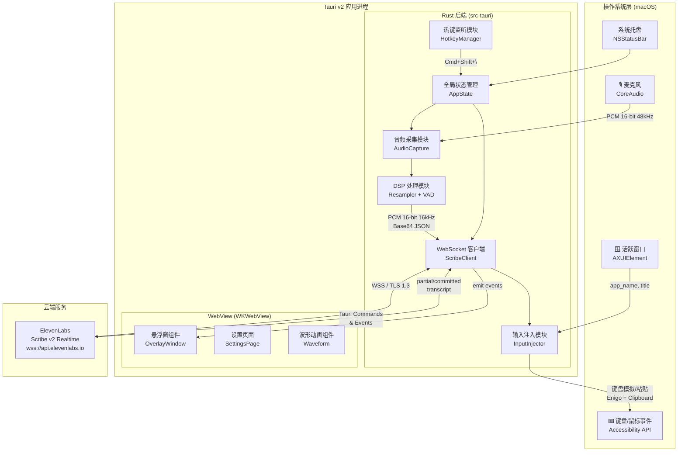
```mermaid
graph TB
    subgraph OS["操作系统层 (macOS)"]
        MIC["🎙️ 麦克风\nCoreAudio"]
        KBD["⌨️ 键盘/鼠标事件\nAccessibility API"]
        WND["🪟 活跃窗口\nAXUIElement"]
        TRAY["系统托盘\nNSStatusBar"]
    end

    subgraph TAURI["Tauri v2 应用进程"]
        subgraph RUST["Rust 后端 (src-tauri)"]
            AUDIO["音频采集模块\nAudioCapture"]
            DSP["DSP 处理模块\nResampler + VAD"]
            WS["WebSocket 客户端\nScribeClient"]
            INPUT["输入注入模块\nInputInjector"]
            HOTKEY["热键监听模块\nHotkeyManager"]
            STATE["全局状态管理\nAppState"]
        end

        subgraph WEBVIEW["WebView (WKWebView)"]
            OVERLAY["悬浮窗组件\nOverlayWindow"]
            SETTINGS["设置页面\nSettingsPage"]
            WAVE["波形动画组件\nWaveform"]
        end

        RUST <-->|"Tauri Commands\n& Events"| WEBVIEW
    end

    subgraph CLOUD["云端服务"]
        SCRIBE["ElevenLabs\nScribe v2 Realtime\nwss://api.elevenlabs.io"]
    end

    MIC -->|"PCM 16-bit 48kHz"| AUDIO
    AUDIO --> DSP
    DSP -->|"PCM 16-bit 16kHz\nBase64 JSON"| WS
    WS <-->|"WSS / TLS 1.3"| SCRIBE
    SCRIBE -->|"partial/committed\ntranscript"| WS
    WS -->|"emit events"| OVERLAY
    WS --> INPUT
    INPUT -->|"键盘模拟/粘贴\nEnigo + Clipboard"| KBD
    HOTKEY -->|"Cmd+Shift+\"| STATE
    STATE --> AUDIO
    STATE --> WS
    TRAY --> STATE
    WND -->|"app_name, title"| INPUT
```

### 1.2 进程与线程模型

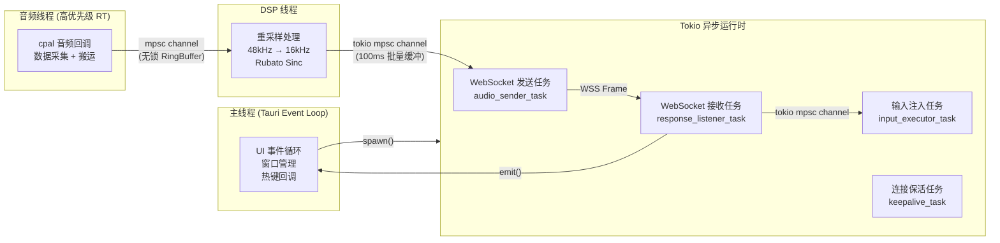
```mermaid
graph LR
    subgraph MainThread["主线程 (Tauri Event Loop)"]
        T_MAIN["UI 事件循环\n窗口管理\n热键回调"]
    end

    subgraph TokioRT["Tokio 异步运行时"]
        T_WS_TX["WebSocket 发送任务\naudio_sender_task"]
        T_WS_RX["WebSocket 接收任务\nresponse_listener_task"]
        T_INPUT["输入注入任务\ninput_executor_task"]
        T_PING["连接保活任务\nkeepalive_task"]
    end

    subgraph AudioThread["音频线程 (高优先级 RT)"]
        T_AUDIO["cpal 音频回调\n数据采集 + 搬运"]
    end

    subgraph DSPThread["DSP 线程"]
        T_DSP["重采样处理\n48kHz → 16kHz\nRubato Sinc"]
    end

    T_AUDIO -->|"mpsc channel\n(无锁 RingBuffer)"| T_DSP
    T_DSP -->|"tokio mpsc channel\n(100ms 批量缓冲)"| T_WS_TX
    T_WS_TX -->|"WSS Frame"| T_WS_RX
    T_WS_RX -->|"emit()"| T_MAIN
    T_WS_RX -->|"tokio mpsc channel"| T_INPUT
    T_MAIN -->|"spawn()"| TokioRT
```

---

## 2. 技术栈与依赖版本

### 2.1 Rust 后端依赖 (Cargo.toml)

```toml
[package]
name = "raflow"
version = "0.1.0"
edition = "2021"

[dependencies]
# ─── Tauri 核心框架 ───
tauri = { version = "2.10", features = ["tray-icon", "protocol-asset"] }
tauri-plugin-global-shortcut = "2.3"   # 全局热键注册
tauri-plugin-clipboard-manager = "2.3" # 剪贴板读写
tauri-plugin-dialog = "2.2"            # 系统对话框（权限引导）
tauri-plugin-fs = "2.2"                # 文件系统（配置持久化）

# ─── 异步运行时与网络 ───
tokio = { version = "1", features = ["full"] }
tokio-tungstenite = { version = "0.28", features = ["rustls-tls-native-roots"] }
futures-util = "0.3"
serde = { version = "1", features = ["derive"] }
serde_json = "1"

# ─── 音频处理 ───
cpal = "0.17"                          # 跨平台音频 I/O (CoreAudio on macOS)
rubato = "0.16"                        # 高质量重采样 (SIMD 加速, Sinc 插值)

# ─── 编码工具 ───
base64 = "0.22"                        # Base64 编码 PCM 数据

# ─── 系统底层交互 ───
enigo = "0.6"                          # 键盘/鼠标模拟 (macOS: CGEvent)
active-win-pos-rs = "0.9"             # 获取活跃窗口信息

# ─── 错误处理与日志 ───
anyhow = "1"
thiserror = "2"
tracing = "0.1"
tracing-subscriber = { version = "0.3", features = ["env-filter"] }

# ─── macOS 系统调用 ───
[target.'cfg(target_os = "macos")'.dependencies]
objc2 = "0.5"                          # Objective-C 运行时
objc2-app-kit = { version = "0.2", features = ["NSApplication"] }
core-foundation = "0.10"
```

### 2.2 前端依赖 (package.json)

```json
{
  "dependencies": {
    "@tauri-apps/api": "2.10",
    "@tauri-apps/plugin-global-shortcut": "2.3",
    "@tauri-apps/plugin-clipboard-manager": "2.3",
    "react": "^19.0.0",
    "react-dom": "^19.0.0"
  },
  "devDependencies": {
    "@tauri-apps/cli": "2.10",
    "vite": "^6.0.0",
    "@vitejs/plugin-react": "^4.0.0",
    "typescript": "^5.7.0"
  }
}
```

### 2.3 ElevenLabs API 规格

| 参数 | 值 |
|------|-----|
| WebSocket 端点 | `wss://api.elevenlabs.io/v1/speech-to-text/realtime` |
| 模型 ID | `scribe_v2_realtime` |
| 认证方式 | HTTP Header: `xi-api-key: <key>` |
| 音频格式 | PCM 16-bit LE，16kHz，单声道 |
| 上行消息类型 | `input_audio_chunk` |
| 转写延迟 | ~150ms |
| 定价 | $0.28/小时音频 |

---

## 3. 工程目录结构

```
raflow/
├── src/                          # 前端源码 (React + TypeScript)
│   ├── components/
│   │   ├── Overlay/              # 悬浮窗组件
│   │   │   ├── Overlay.tsx       # 悬浮窗主组件
│   │   │   ├── Waveform.tsx      # 音频波形动画
│   │   │   └── TranscriptText.tsx # 转写文本展示
│   │   └── Settings/             # 设置页面组件
│   │       ├── Settings.tsx
│   │       ├── ApiKeyInput.tsx
│   │       └── HotkeyConfig.tsx
│   ├── hooks/
│   │   ├── useTranscript.ts      # 转写事件监听 Hook
│   │   └── useAudioLevel.ts      # 音量事件监听 Hook
│   ├── store/
│   │   └── appStore.ts           # Zustand 状态管理
│   ├── App.tsx
│   └── main.tsx
│
├── src-tauri/                    # Rust 后端源码
│   ├── src/
│   │   ├── lib.rs                # Tauri Builder 入口
│   │   ├── state.rs              # 全局 AppState 定义
│   │   ├── commands.rs           # Tauri Command 注册
│   │   │
│   │   ├── audio/
│   │   │   ├── mod.rs
│   │   │   ├── capture.rs        # cpal 音频采集
│   │   │   └── resampler.rs      # rubato 重采样
│   │   │
│   │   ├── network/
│   │   │   ├── mod.rs
│   │   │   ├── scribe_client.rs  # WebSocket 客户端状态机
│   │   │   └── protocol.rs       # ElevenLabs 消息结构定义
│   │   │
│   │   ├── input/
│   │   │   ├── mod.rs
│   │   │   ├── injector.rs       # 文本注入策略
│   │   │   └── window_ctx.rs     # 活跃窗口信息获取
│   │   │
│   │   ├── hotkey/
│   │   │   └── manager.rs        # 全局热键管理
│   │   │
│   │   └── permissions/
│   │       └── macos.rs          # macOS 权限检测与申请
│   │
│   ├── capabilities/
│   │   └── default.json          # Tauri ACL 权限配置
│   │
│   ├── icons/                    # 应用图标
│   ├── Cargo.toml
│   └── tauri.conf.json           # Tauri 应用配置
│
├── package.json
├── vite.config.ts
└── tsconfig.json
```

---

## 4. 核心组件设计

### 4.1 组件依赖关系图

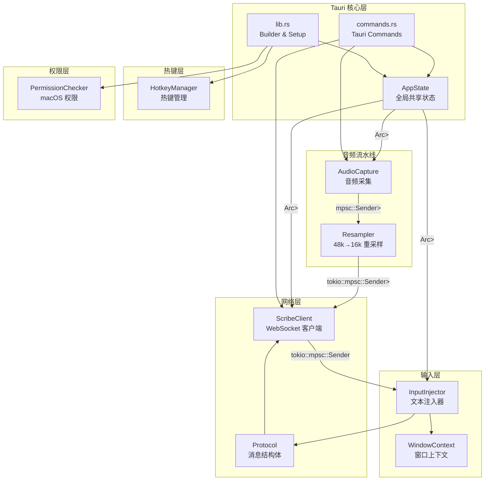
```mermaid
graph TD
    subgraph Tauri["Tauri 核心层"]
        LIB["lib.rs\nBuilder & Setup"]
        STATE["AppState\n全局共享状态"]
        CMD["commands.rs\nTauri Commands"]
    end

    subgraph AudioPipeline["音频流水线"]
        CAP["AudioCapture\n音频采集"]
        RES["Resampler\n48k→16k 重采样"]
    end

    subgraph NetworkLayer["网络层"]
        SC["ScribeClient\nWebSocket 客户端"]
        PROTO["Protocol\n消息结构体"]
    end

    subgraph InputLayer["输入层"]
        INJ["InputInjector\n文本注入器"]
        WCTX["WindowContext\n窗口上下文"]
    end

    subgraph HotkeyLayer["热键层"]
        HKM["HotkeyManager\n热键管理"]
    end

    subgraph PermLayer["权限层"]
        PERM["PermissionChecker\nmacOS 权限"]
    end

    LIB --> STATE
    LIB --> HKM
    LIB --> PERM
    CMD --> STATE
    CMD --> CAP
    CMD --> SC

    STATE -->|"Arc<Mutex<...>>"| CAP
    STATE -->|"Arc<Mutex<...>>"| SC
    STATE -->|"Arc<Mutex<...>>"| INJ

    CAP -->|"mpsc::Sender<Vec<i16>>"| RES
    RES -->|"tokio::mpsc::Sender<Vec<i16>>"| SC
    SC -->|"tokio::mpsc::Sender<String>"| INJ
    INJ --> WCTX
    INJ --> PROTO

    PROTO --> SC
```

### 4.2 AppState 数据结构

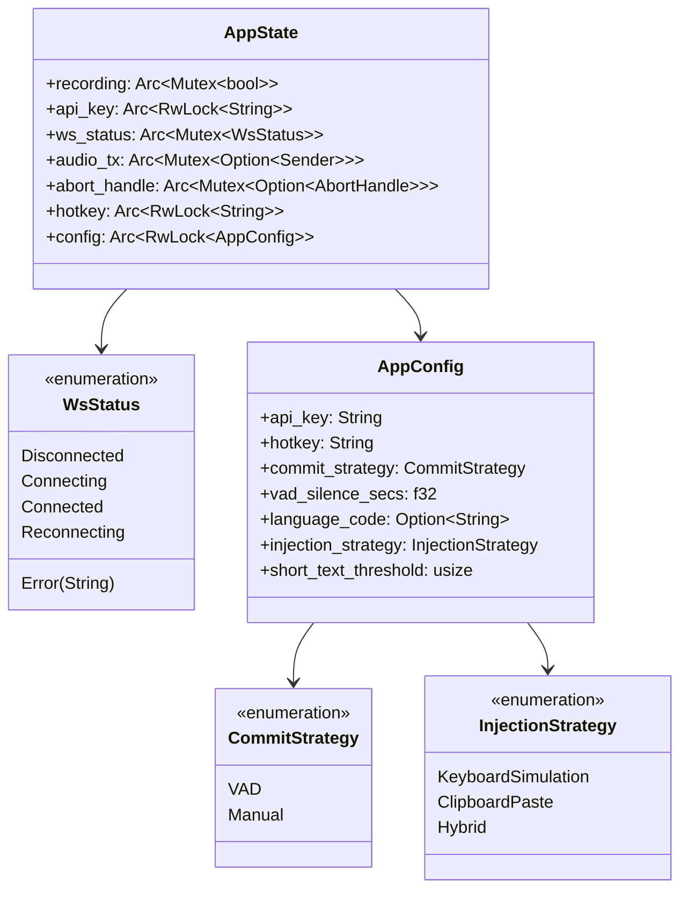
```mermaid
classDiagram
    class AppState {
        +recording: Arc~Mutex~bool~~
        +api_key: Arc~RwLock~String~~
        +ws_status: Arc~Mutex~WsStatus~~
        +audio_tx: Arc~Mutex~Option~Sender~~~
        +abort_handle: Arc~Mutex~Option~AbortHandle~~~
        +hotkey: Arc~RwLock~String~~
        +config: Arc~RwLock~AppConfig~~
    }

    class WsStatus {
        <<enumeration>>
        Disconnected
        Connecting
        Connected
        Reconnecting
        Error(String)
    }

    class AppConfig {
        +api_key: String
        +hotkey: String
        +commit_strategy: CommitStrategy
        +vad_silence_secs: f32
        +language_code: Option~String~
        +injection_strategy: InjectionStrategy
        +short_text_threshold: usize
    }

    class CommitStrategy {
        <<enumeration>>
        VAD
        Manual
    }

    class InjectionStrategy {
        <<enumeration>>
        KeyboardSimulation
        ClipboardPaste
        Hybrid
    }

    AppState --> WsStatus
    AppState --> AppConfig
    AppConfig --> CommitStrategy
    AppConfig --> InjectionStrategy
```

---

## 5. 音频处理流水线（DSP Pipeline）

### 5.1 音频数据流图

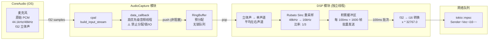
```mermaid
flowchart LR
    subgraph CoreAudio["CoreAudio (OS)"]
        MIC["麦克风\n原始 PCM\n44.1kHz/48kHz\nf32 立体声"]
    end

    subgraph AudioCapture["AudioCapture 模块"]
        CPAL["cpal\nbuild_input_stream"]
        CB["data_callback\n高优先级音频线程\n⚠️ 禁止分配/锁/IO"]
        RING["RingBuffer\n预分配\n无锁队列"]
    end

    subgraph DSPModule["DSP 模块 (独立线程)"]
        MONO["立体声 → 单声道\n平均左右声道"]
        RESAMP["Rubato Sinc 重采样\n48kHz → 16kHz\n比率: 1/3"]
        ACCUM["积累缓冲区\n每 100ms = 1600 帧\n批量发送"]
        F32I16["f32 → i16 转换\nx * 32767.0"]
    end

    subgraph NetworkQueue["网络队列"]
        TX["tokio::mpsc\nSender~Vec~i16~~"]
    end

    MIC -->|"f32 samples"| CPAL
    CPAL --> CB
    CB -->|"push (非阻塞)"| RING
    RING -->|"pop"| MONO
    MONO --> RESAMP
    RESAMP --> ACCUM
    ACCUM -->|"100ms 批次"| F32I16
    F32I16 --> TX
```

### 5.2 重采样参数配置

| 参数 | 值 | 说明 |
|------|-----|------|
| 输入采样率 | 48,000 Hz | macOS 默认麦克风采样率 |
| 输出采样率 | 16,000 Hz | Scribe v2 要求 |
| 重采样比率 | 1/3 | 48k ÷ 16k |
| 算法 | Sinc 插值 | Rubato `SincFixedIn` |
| Sinc 长度 | 256 | 质量与延迟的平衡点 |
| 窗函数 | Blackman-Harris | 低旁瓣，防止混叠 |
| 批量大小 | 4800 帧 (100ms @ 48k) | 输出 1600 帧 (100ms @ 16k) |
| 通道数 | 1 (单声道) | 先下混为单声道再重采样 |

### 5.3 音量 RMS 计算

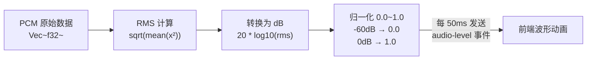
```mermaid
flowchart LR
    PCM["PCM 原始数据\nVec~f32~"] --> RMS["RMS 计算\nsqrt(mean(x²))"]
    RMS --> DB["转换为 dB\n20 * log10(rms)"]
    DB --> NORM["归一化 0.0~1.0\n-60dB → 0.0\n0dB → 1.0"]
    NORM -->|"每 50ms 发送\naudio-level 事件"| UI["前端波形动画"]
```

---

## 6. 网络传输层设计

### 6.1 WebSocket 连接状态机

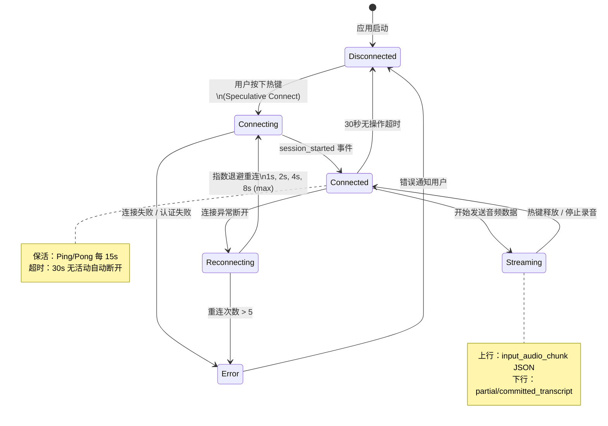
```mermaid
stateDiagram-v2
    [*] --> Disconnected : 应用启动

    Disconnected --> Connecting : 用户按下热键\n(Speculative Connect)
    Connecting --> Connected : session_started 事件
    Connecting --> Error : 连接失败 / 认证失败
    Connected --> Streaming : 开始发送音频数据
    Streaming --> Connected : 热键释放 / 停止录音
    Connected --> Disconnected : 30秒无操作超时
    Connected --> Reconnecting : 连接异常断开
    Reconnecting --> Connecting : 指数退避重连\n1s, 2s, 4s, 8s (max)
    Error --> Disconnected : 错误通知用户
    Reconnecting --> Error : 重连次数 > 5

    note right of Connected
        保活：Ping/Pong 每 15s
        超时：30s 无活动自动断开
    end note

    note right of Streaming
        上行：input_audio_chunk JSON
        下行：partial/committed_transcript
    end note
```

### 6.2 ElevenLabs 消息协议结构

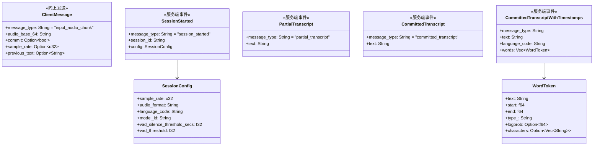
```mermaid
classDiagram
    class ClientMessage {
        <<向上发送>>
        +message_type: String = "input_audio_chunk"
        +audio_base_64: String
        +commit: Option~bool~
        +sample_rate: Option~u32~
        +previous_text: Option~String~
    }

    class SessionStarted {
        <<服务端事件>>
        +message_type: String = "session_started"
        +session_id: String
        +config: SessionConfig
    }

    class PartialTranscript {
        <<服务端事件>>
        +message_type: String = "partial_transcript"
        +text: String
    }

    class CommittedTranscript {
        <<服务端事件>>
        +message_type: String = "committed_transcript"
        +text: String
    }

    class CommittedTranscriptWithTimestamps {
        <<服务端事件>>
        +message_type: String
        +text: String
        +language_code: String
        +words: Vec~WordToken~
    }

    class WordToken {
        +text: String
        +start: f64
        +end: f64
        +type_: String
        +logprob: Option~f64~
        +characters: Option~Vec~String~~
    }

    class SessionConfig {
        +sample_rate: u32
        +audio_format: String
        +language_code: String
        +model_id: String
        +vad_silence_threshold_secs: f32
        +vad_threshold: f32
    }

    SessionStarted --> SessionConfig
    CommittedTranscriptWithTimestamps --> WordToken
```

### 6.3 发送与接收任务设计

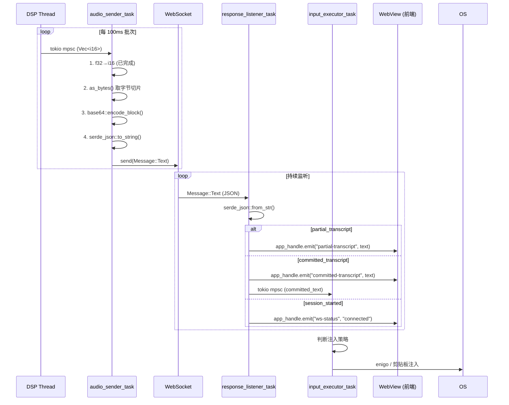
```mermaid
sequenceDiagram
    participant DSP as DSP Thread
    participant TxTask as audio_sender_task
    participant WS as WebSocket
    participant RxTask as response_listener_task
    participant InputTask as input_executor_task
    participant UI as WebView (前端)

    loop 每 100ms 批次
        DSP->>TxTask: tokio mpsc (Vec<i16>)
        TxTask->>TxTask: 1. f32→i16 (已完成)
        TxTask->>TxTask: 2. as_bytes() 取字节切片
        TxTask->>TxTask: 3. base64::encode_block()
        TxTask->>TxTask: 4. serde_json::to_string()
        TxTask->>WS: send(Message::Text)
    end

    loop 持续监听
        WS->>RxTask: Message::Text (JSON)
        RxTask->>RxTask: serde_json::from_str()

        alt partial_transcript
            RxTask->>UI: app_handle.emit("partial-transcript", text)
        else committed_transcript
            RxTask->>UI: app_handle.emit("committed-transcript", text)
            RxTask->>InputTask: tokio mpsc (committed_text)
        else session_started
            RxTask->>UI: app_handle.emit("ws-status", "connected")
        end
    end

    InputTask->>InputTask: 判断注入策略
    InputTask->>OS: enigo / 剪贴板注入
```

---

## 7. 系统输入注入模块

### 7.1 文本注入决策树

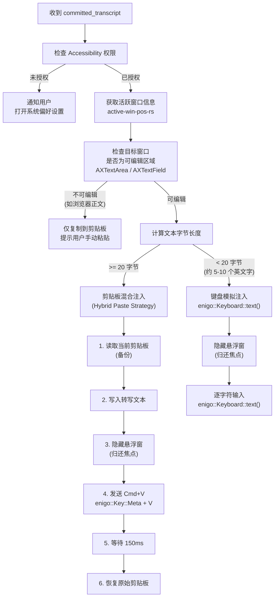
```mermaid
flowchart TD
    START["收到 committed_transcript"] --> CHECK_PERM["检查 Accessibility 权限"]

    CHECK_PERM -->|"未授权"| NOTIFY["通知用户\n打开系统偏好设置"]
    CHECK_PERM -->|"已授权"| CHECK_LEN["获取活跃窗口信息\nactive-win-pos-rs"]

    CHECK_LEN --> GET_WIN["检查目标窗口\n是否为可编辑区域\nAXTextArea / AXTextField"]

    GET_WIN -->|"不可编辑\n(如浏览器正文)"| COPY_ONLY["仅复制到剪贴板\n提示用户手动粘贴"]
    GET_WIN -->|"可编辑"| MEASURE["计算文本字节长度"]

    MEASURE -->|"< 20 字节\n(约 5-10 个英文字)"| KEYBOARD["键盘模拟注入\nenigo::Keyboard::text()"]
    MEASURE -->|">= 20 字节"| CLIPBOARD["剪贴板混合注入\n(Hybrid Paste Strategy)"]

    CLIPBOARD --> READ_CB["1. 读取当前剪贴板\n(备份)"]
    READ_CB --> WRITE_CB["2. 写入转写文本"]
    WRITE_CB --> HIDE_WIN["3. 隐藏悬浮窗\n(归还焦点)"]
    HIDE_WIN --> SEND_PASTE["4. 发送 Cmd+V\nenigo::Key::Meta + V"]
    SEND_PASTE --> DELAY["5. 等待 150ms"]
    DELAY --> RESTORE_CB["6. 恢复原始剪贴板"]

    KEYBOARD --> HIDE_WIN2["隐藏悬浮窗\n(归还焦点)"]
    HIDE_WIN2 --> TYPE_TEXT["逐字符输入\nenigo::Keyboard::text()"]
```

### 7.2 焦点管理策略

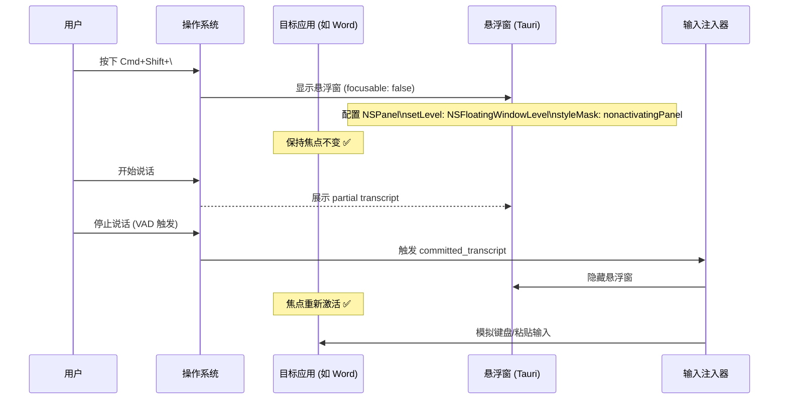
```mermaid
sequenceDiagram
    participant User as 用户
    participant OS as 操作系统
    participant TargetApp as 目标应用 (如 Word)
    participant Overlay as 悬浮窗 (Tauri)
    participant Injector as 输入注入器

    User->>OS: 按下 Cmd+Shift+\
    OS->>Overlay: 显示悬浮窗 (focusable: false)
    Note over Overlay: 配置 NSPanel\nsetLevel: NSFloatingWindowLevel\nstyleMask: nonactivatingPanel
    Note over TargetApp: 保持焦点不变 ✅

    User->>OS: 开始说话
    OS-->>Overlay: 展示 partial transcript

    User->>OS: 停止说话 (VAD 触发)
    OS->>Injector: 触发 committed_transcript
    Injector->>Overlay: 隐藏悬浮窗
    Note over TargetApp: 焦点重新激活 ✅
    Injector->>TargetApp: 模拟键盘/粘贴输入
```

### 7.3 enigo 0.6 新 API 用法

```rust
// enigo 0.6.x 新 API (重大变更！)
use enigo::{Enigo, Settings, Keyboard, Key, Direction};

fn inject_text_keyboard(text: &str) -> Result<()> {
    let mut enigo = Enigo::new(&Settings::default())?;
    enigo.text(text)?; // 直接输入 Unicode 文本
    Ok(())
}

fn inject_paste_hotkey() -> Result<()> {
    let mut enigo = Enigo::new(&Settings::default())?;
    // macOS: Cmd+V
    enigo.key(Key::Meta, Direction::Press)?;
    enigo.key(Key::Unicode('v'), Direction::Click)?;
    enigo.key(Key::Meta, Direction::Release)?;
    Ok(())
}
```

---

## 8. 状态机设计

### 8.1 应用整体生命周期状态机

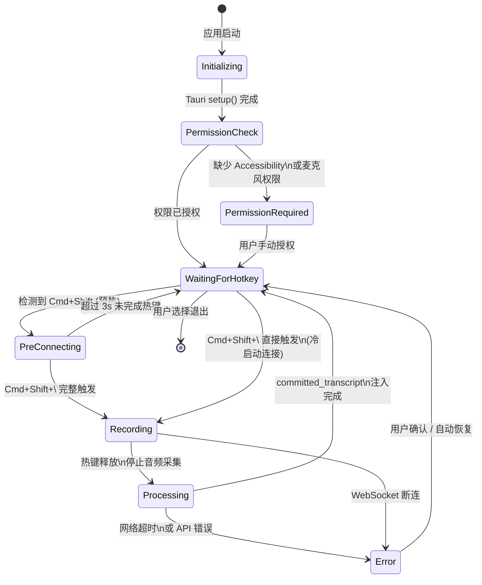
```mermaid
stateDiagram-v2
    [*] --> Initializing : 应用启动

    Initializing --> PermissionCheck : Tauri setup() 完成

    PermissionCheck --> WaitingForHotkey : 权限已授权
    PermissionCheck --> PermissionRequired : 缺少 Accessibility\n或麦克风权限
    PermissionRequired --> WaitingForHotkey : 用户手动授权

    WaitingForHotkey --> PreConnecting : 检测到 Cmd+Shift (预热)
    PreConnecting --> WaitingForHotkey : 超过 3s 未完成热键
    PreConnecting --> Recording : Cmd+Shift+\ 完整触发

    WaitingForHotkey --> Recording : Cmd+Shift+\ 直接触发\n(冷启动连接)

    Recording --> Processing : 热键释放\n停止音频采集
    Processing --> WaitingForHotkey : committed_transcript\n注入完成
    Processing --> Error : 网络超时\n或 API 错误

    Recording --> Error : WebSocket 断连

    Error --> WaitingForHotkey : 用户确认 / 自动恢复

    WaitingForHotkey --> [*] : 用户选择退出
```

### 8.2 录制会话状态机

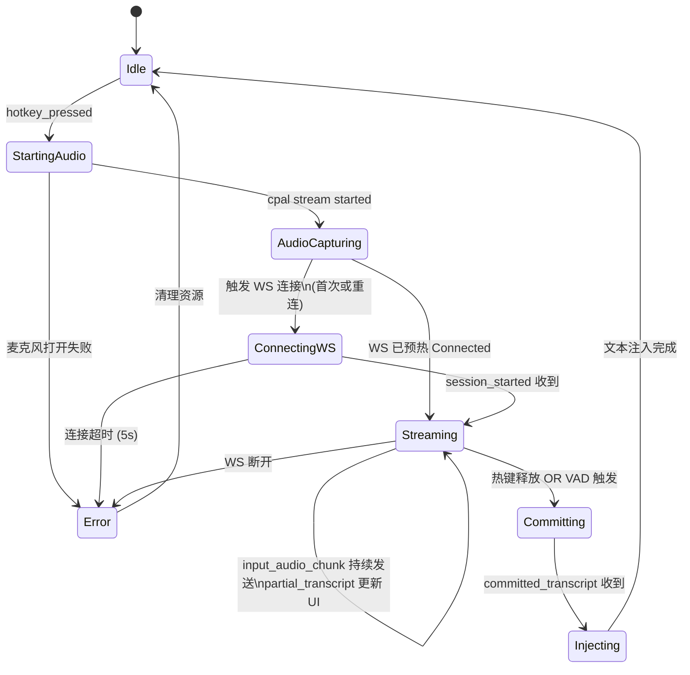
```mermaid
stateDiagram-v2
    [*] --> Idle

    Idle --> StartingAudio : hotkey_pressed
    StartingAudio --> AudioCapturing : cpal stream started
    StartingAudio --> Error : 麦克风打开失败

    AudioCapturing --> ConnectingWS : 触发 WS 连接\n(首次或重连)
    AudioCapturing --> Streaming : WS 已预热 Connected

    ConnectingWS --> Streaming : session_started 收到
    ConnectingWS --> Error : 连接超时 (5s)

    Streaming --> Streaming : input_audio_chunk 持续发送\npartial_transcript 更新 UI

    Streaming --> Committing : 热键释放 OR VAD 触发
    Committing --> Injecting : committed_transcript 收到
    Injecting --> Idle : 文本注入完成

    Streaming --> Error : WS 断开
    Error --> Idle : 清理资源
```

---

## 9. 前端 UI 设计

### 9.1 UI 组件树

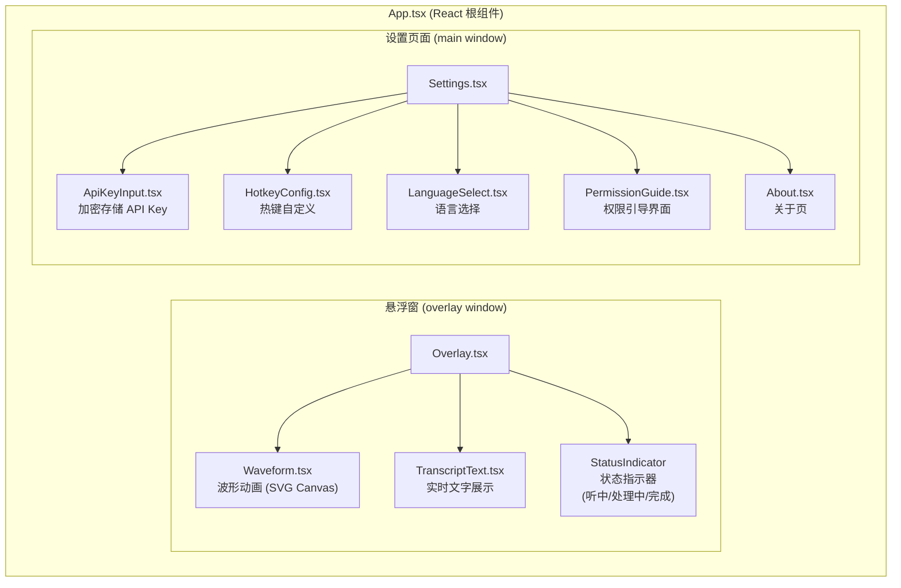
```mermaid
graph TD
    subgraph App["App.tsx (React 根组件)"]
        subgraph OverlayWindow["悬浮窗 (overlay window)"]
            OV["Overlay.tsx"]
            OV --> WF["Waveform.tsx\n波形动画 (SVG Canvas)"]
            OV --> TT["TranscriptText.tsx\n实时文字展示"]
            OV --> STATUS["StatusIndicator\n状态指示器\n(听中/处理中/完成)"]
        end

        subgraph SettingsWindow["设置页面 (main window)"]
            SW["Settings.tsx"]
            SW --> AK["ApiKeyInput.tsx\n加密存储 API Key"]
            SW --> HK["HotkeyConfig.tsx\n热键自定义"]
            SW --> LNG["LanguageSelect.tsx\n语言选择"]
            SW --> PERM_UI["PermissionGuide.tsx\n权限引导界面"]
            SW --> ABOUT["About.tsx\n关于页"]
        end
    end
```

### 9.2 悬浮窗视觉设计

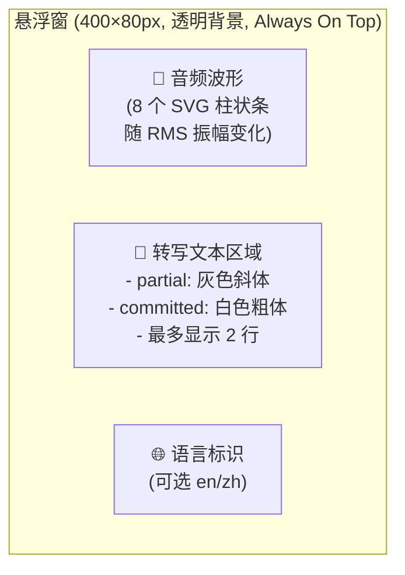
```mermaid
graph LR
    subgraph Overlay["悬浮窗 (400×80px, 透明背景, Always On Top)"]
        direction LR
        WAVE_VIS["🔴 音频波形\n(8 个 SVG 柱状条\n随 RMS 振幅变化)"]
        TEXT_VIS["📝 转写文本区域\n- partial: 灰色斜体\n- committed: 白色粗体\n- 最多显示 2 行"]
        LANG_VIS["🌐 语言标识\n(可选 en/zh)"]
    end
```

### 9.3 Tauri 窗口配置 (tauri.conf.json)

```json
{
  "app": {
    "windows": [
      {
        "label": "main",
        "title": "RaFlow Settings",
        "width": 520,
        "height": 680,
        "resizable": false,
        "visible": false,
        "center": true
      },
      {
        "label": "overlay",
        "title": "",
        "width": 420,
        "height": 90,
        "decorations": false,
        "transparent": true,
        "alwaysOnTop": true,
        "skipTaskbar": true,
        "visible": false,
        "resizable": false,
        "shadow": false,
        "focus": false
      }
    ],
    "trayIcon": {
      "iconPath": "icons/tray.png",
      "iconAsTemplate": true
    }
  }
}
```

---

## 10. 前后端通信协议

### 10.1 Tauri Events（后端 → 前端）

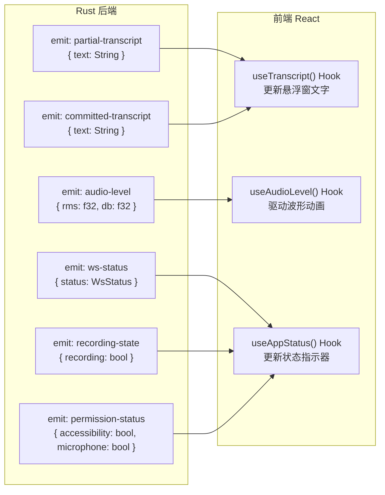
```mermaid
graph LR
    subgraph RustBackend["Rust 后端"]
        E1["emit: partial-transcript\n{ text: String }"]
        E2["emit: committed-transcript\n{ text: String }"]
        E3["emit: audio-level\n{ rms: f32, db: f32 }"]
        E4["emit: ws-status\n{ status: WsStatus }"]
        E5["emit: recording-state\n{ recording: bool }"]
        E6["emit: permission-status\n{ accessibility: bool, microphone: bool }"]
    end

    subgraph Frontend["前端 React"]
        H1["useTranscript() Hook\n更新悬浮窗文字"]
        H2["useAudioLevel() Hook\n驱动波形动画"]
        H3["useAppStatus() Hook\n更新状态指示器"]
    end

    E1 --> H1
    E2 --> H1
    E3 --> H2
    E4 --> H3
    E5 --> H3
    E6 --> H3
```

### 10.2 Tauri Commands（前端 → 后端）

| Command 名称 | 参数 | 返回值 | 描述 |
|-------------|------|--------|------|
| `start_recording` | — | `Result<()>` | 开始录音并连接 WS |
| `stop_recording` | — | `Result<()>` | 停止录音，等待最终转写 |
| `save_config` | `AppConfig` | `Result<()>` | 保存用户配置 |
| `get_config` | — | `AppConfig` | 读取当前配置 |
| `check_permissions` | — | `PermissionStatus` | 检查系统权限 |
| `request_permissions` | — | `Result<()>` | 弹出权限申请对话框 |
| `get_ws_status` | — | `WsStatus` | 获取 WebSocket 状态 |

---

## 11. Tauri 权限配置

### 11.1 ACL 权限文件 (capabilities/default.json)

```json
{
  "$schema": "../gen/schemas/desktop-schema.json",
  "identifier": "default",
  "description": "RaFlow 主窗口权限集",
  "windows": ["main", "overlay"],
  "permissions": [
    "core:default",
    "core:window:allow-hide",
    "core:window:allow-show",
    "core:window:allow-set-focus",
    "core:window:allow-set-position",
    "global-shortcut:allow-register",
    "global-shortcut:allow-unregister",
    "global-shortcut:allow-is-registered",
    "clipboard-manager:allow-write-text",
    "clipboard-manager:allow-read-text",
    "fs:allow-app-write",
    "fs:allow-app-read",
    "dialog:allow-message",
    "dialog:allow-open"
  ]
}
```

### 11.2 macOS 权限矩阵

| 权限 | 用途 | 申请时机 | 缺失时降级策略 |
|------|------|---------|--------------|
| 麦克风 (Microphone) | 音频采集 | 首次启动 | 不可降级，提示用户 |
| 辅助功能 (Accessibility) | 键盘模拟输入 | 首次录音 | 降级为剪贴板模式 |
| 屏幕录制 (Screen Recording) | 获取窗口标题 | 可选 | 仅使用 app_name |

---

## 12. 关键时序流程

### 12.1 首次启动完整时序

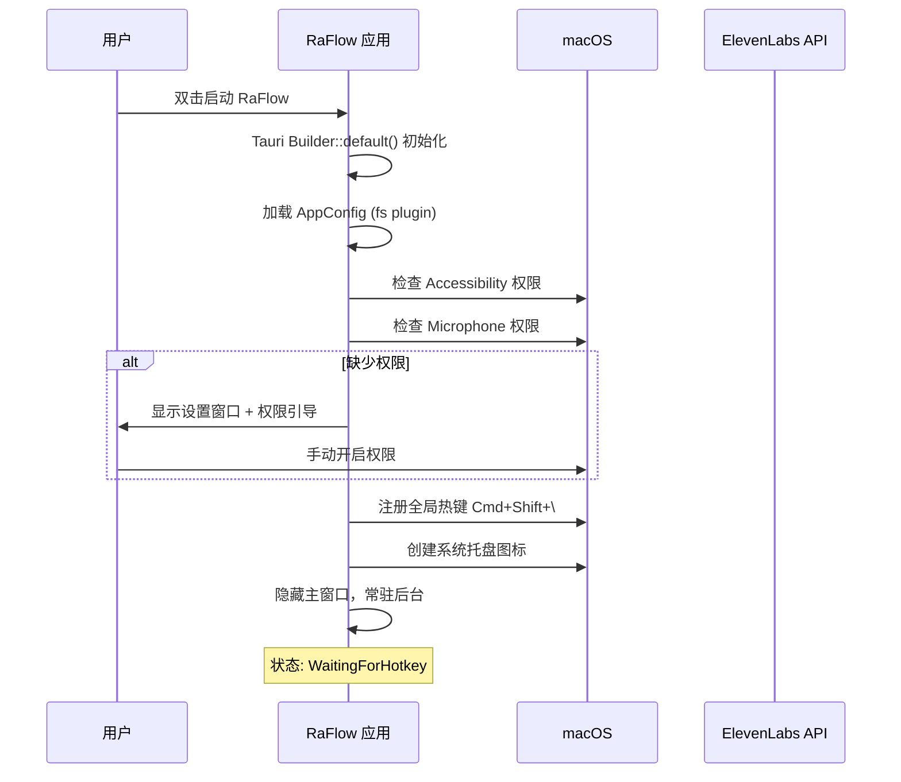
```mermaid
sequenceDiagram
    participant User as 用户
    participant App as RaFlow 应用
    participant OS as macOS
    participant EL as ElevenLabs API

    User->>App: 双击启动 RaFlow
    App->>App: Tauri Builder::default() 初始化
    App->>App: 加载 AppConfig (fs plugin)
    App->>OS: 检查 Accessibility 权限
    App->>OS: 检查 Microphone 权限

    alt 缺少权限
        App->>User: 显示设置窗口 + 权限引导
        User->>OS: 手动开启权限
    end

    App->>OS: 注册全局热键 Cmd+Shift+\
    App->>OS: 创建系统托盘图标
    App->>App: 隐藏主窗口，常驻后台
    Note over App: 状态: WaitingForHotkey
```

### 12.2 录音与转写完整时序

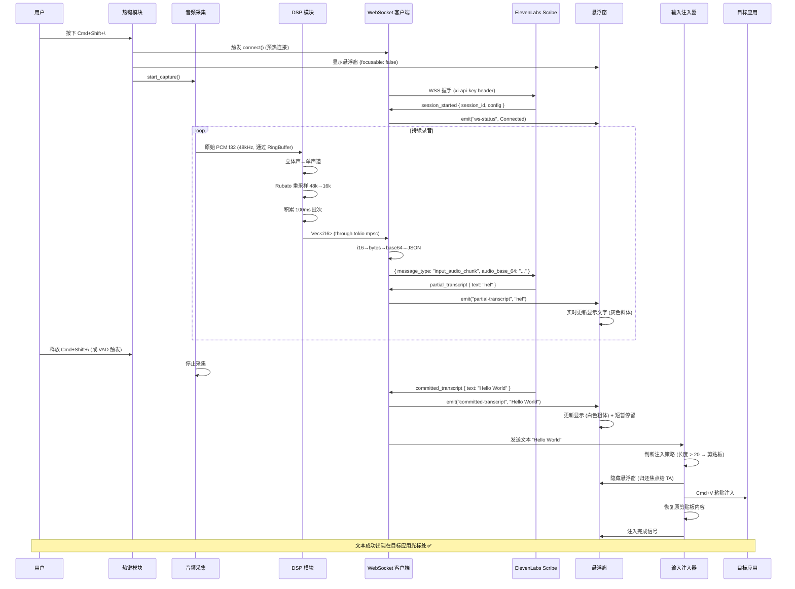
```mermaid
sequenceDiagram
    participant User as 用户
    participant HK as 热键模块
    participant AC as 音频采集
    participant DSP as DSP 模块
    participant WS as WebSocket 客户端
    participant EL as ElevenLabs Scribe
    participant UI as 悬浮窗
    participant INJ as 输入注入器
    participant TA as 目标应用

    User->>HK: 按下 Cmd+Shift+\
    HK->>WS: 触发 connect() (预热连接)
    HK->>UI: 显示悬浮窗 (focusable: false)
    HK->>AC: start_capture()

    WS->>EL: WSS 握手 (xi-api-key header)
    EL->>WS: session_started { session_id, config }
    WS->>UI: emit("ws-status", Connected)

    loop 持续录音
        AC->>DSP: 原始 PCM f32 (48kHz, 通过 RingBuffer)
        DSP->>DSP: 立体声→单声道
        DSP->>DSP: Rubato 重采样 48k→16k
        DSP->>DSP: 积累 100ms 批次
        DSP->>WS: Vec<i16> (through tokio mpsc)
        WS->>WS: i16→bytes→base64→JSON
        WS->>EL: { message_type: "input_audio_chunk", audio_base_64: "..." }

        EL->>WS: partial_transcript { text: "hel" }
        WS->>UI: emit("partial-transcript", "hel")
        UI->>UI: 实时更新显示文字 (灰色斜体)
    end

    User->>HK: 释放 Cmd+Shift+\ (或 VAD 触发)
    AC->>AC: 停止采集
    EL->>WS: committed_transcript { text: "Hello World" }
    WS->>UI: emit("committed-transcript", "Hello World")
    UI->>UI: 更新显示 (白色粗体) + 短暂停留

    WS->>INJ: 发送文本 "Hello World"
    INJ->>INJ: 判断注入策略 (长度 > 20 → 剪贴板)
    INJ->>UI: 隐藏悬浮窗 (归还焦点给 TA)
    INJ->>TA: Cmd+V 粘贴注入
    INJ->>INJ: 恢复原剪贴板内容
    INJ->>UI: 注入完成信号

    Note over User,TA: 文本成功出现在目标应用光标处 ✅
```

### 12.3 错误恢复与重连时序

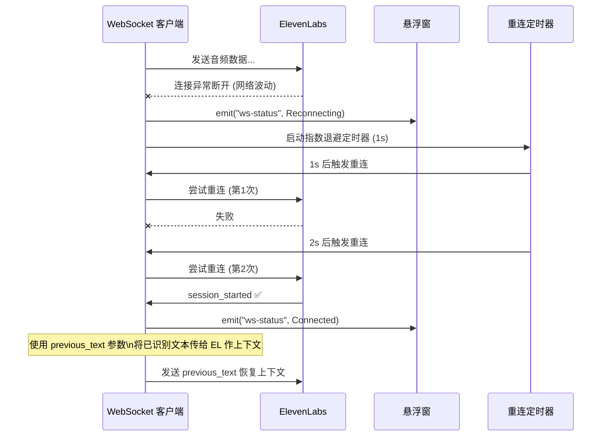
```mermaid
sequenceDiagram
    participant WS as WebSocket 客户端
    participant EL as ElevenLabs
    participant UI as 悬浮窗
    participant Timer as 重连定时器

    WS->>EL: 发送音频数据...
    EL--xWS: 连接异常断开 (网络波动)

    WS->>UI: emit("ws-status", Reconnecting)
    WS->>Timer: 启动指数退避定时器 (1s)

    Timer->>WS: 1s 后触发重连
    WS->>EL: 尝试重连 (第1次)
    EL--xWS: 失败

    Timer->>WS: 2s 后触发重连
    WS->>EL: 尝试重连 (第2次)
    EL->>WS: session_started ✅

    WS->>UI: emit("ws-status", Connected)
    Note over WS: 使用 previous_text 参数\n将已识别文本传给 EL 作上下文
    WS->>EL: 发送 previous_text 恢复上下文
```

---

## 13. 错误处理与容错策略

### 13.1 错误类型层级

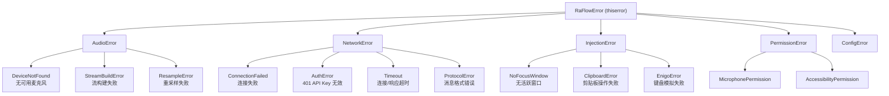
```mermaid
graph TD
    ROOT["RaFlowError (thiserror)"]

    ROOT --> AE["AudioError"]
    ROOT --> NE["NetworkError"]
    ROOT --> IE["InjectionError"]
    ROOT --> PE["PermissionError"]
    ROOT --> CE["ConfigError"]

    AE --> AE1["DeviceNotFound\n无可用麦克风"]
    AE --> AE2["StreamBuildError\n流构建失败"]
    AE --> AE3["ResampleError\n重采样失败"]

    NE --> NE1["ConnectionFailed\n连接失败"]
    NE --> NE2["AuthError\n401 API Key 无效"]
    NE --> NE3["Timeout\n连接/响应超时"]
    NE --> NE4["ProtocolError\n消息格式错误"]

    IE --> IE1["NoFocusWindow\n无活跃窗口"]
    IE --> IE2["ClipboardError\n剪贴板操作失败"]
    IE --> IE3["EnigoError\n键盘模拟失败"]

    PE --> PE1["MicrophonePermission"]
    PE --> PE2["AccessibilityPermission"]
```

### 13.2 容错降级策略

| 场景 | 主策略 | 降级策略 | 用户通知 |
|------|--------|---------|---------|
| WebSocket 断连 | 指数退避重连 (最多5次) | 提示用户检查网络 | 托盘图标变红 |
| 麦克风采集失败 | 重试打开设备 | 停止录音，提示更换设备 | Toast 通知 |
| 键盘注入失败 | 剪贴板粘贴 | 仅复制到剪贴板 | Toast 通知 |
| Accessibility 权限缺失 | 跳转系统设置 | 仅使用剪贴板模式 | 设置窗口引导 |
| API Key 无效 | 提示重新输入 | 停止所有录音功能 | 设置窗口弹出 |

---

## 14. 安全设计

### 14.1 API Key 存储

```mermaid
flowchart TD
    USER["用户输入 API Key\n(Settings 页面)"] --> VALIDATE["格式验证\nsk-... 前缀检查"]
    VALIDATE --> ENCRYPT["AES-256-GCM 加密\n密钥派生: 设备唯一 ID\n+ 应用 Bundle ID"]
    ENCRYPT --> STORE["写入 macOS Keychain\n通过 tauri-plugin-fs\n加密存储到 AppData"]

    STORE --> LOAD["应用启动时读取"]
    LOAD --> DECRYPT["解密还原 API Key"]
    DECRYPT --> MEMORY["仅在内存中持有\nRust Arc<RwLock<String>>"]
    MEMORY --> WS_HEADER["WSS 握手时\n注入 xi-api-key Header"]
```

### 14.2 权限最小化原则

- 剪贴板 `read` 权限：仅在混合注入策略中临时读取（备份旧内容），读取后立即清空引用
- 不请求屏幕录制权限（非必须）：仅使用 `active-win-pos-rs` 获取 app_name
- 网络请求白名单：仅允许连接 `api.elevenlabs.io`（通过 CSP 配置限制 WebView）

---

## 15. 性能指标与优化目标

### 15.1 关键性能指标 (KPI)

| 指标 | 目标值 | 说明 |
|------|--------|------|
| 端到端延迟 | < 300ms | 从说话结束到文字出现 |
| 首字延迟 (预热) | < 50ms | Speculative Connection 已建立时 |
| 首字延迟 (冷启动) | < 600ms | 含 DNS+TLS+WS 握手 |
| 音频回调延迟 | < 5ms | cpal 回调到 RingBuffer push |
| 内存占用 | < 80MB | 常驻后台时 Tauri + Rust 总占用 |
| CPU 占用 (录音中) | < 5% | M1 MacBook，含重采样 |
| CPU 占用 (待机) | < 0.1% | 常驻后台，无录音 |

### 15.2 性能优化策略

```mermaid
graph LR
    subgraph AudioOpt["音频优化"]
        O1["预分配 RingBuffer\n避免回调内堆分配"]
        O2["SIMD 重采样\nRubato 自动使用 AVX/Neon"]
        O3["批量发送 100ms\n减少 WebSocket 帧数量"]
    end

    subgraph NetworkOpt["网络优化"]
        O4["Speculative Connect\n提前建立 WS 连接"]
        O5["rustls TLS\n比 OpenSSL 更快握手"]
        O6["前向上下文 previous_text\n减少重连后重识别"]
    end

    subgraph UIopt["UI 优化"]
        O7["App Nap 防护\nmacOSPrivateApi: true"]
        O8["requestAnimationFrame\n60fps 波形渲染"]
        O9["partial_transcript 防抖\n16ms 批量更新 DOM"]
    end
```

---

## 附录：关键引用与资源

| 资源 | 地址 |
|------|------|
| ElevenLabs Scribe v2 Realtime API | https://elevenlabs.io/docs/api-reference/speech-to-text/v-1-speech-to-text-realtime |
| Tauri v2 文档 | https://v2.tauri.app |
| cpal 0.17 文档 | https://docs.rs/cpal/0.17 |
| rubato 0.16 文档 | https://docs.rs/rubato/0.16 |
| enigo 0.6 变更日志 | https://github.com/enigo-rs/enigo/blob/main/CHANGES.md |
| tokio-tungstenite 0.28 | https://docs.rs/tokio-tungstenite/0.28 |
