# RaFlow — 实现计划文档

> 基于 `0002-design.md` 的详细落地实现指南
>
> 版本：1.0 | 日期：2026-03-08

---

## 目录

1. [实现阶段总览](#1-实现阶段总览)
2. [阶段 P0：项目脚手架](#2-阶段-p0项目脚手架)
3. [阶段 P1：全局状态与配置](#3-阶段-p1全局状态与配置)
4. [阶段 P2：音频采集与 DSP 流水线](#4-阶段-p2音频采集与-dsp-流水线)
5. [阶段 P3：ElevenLabs WebSocket 网络层](#5-阶段-p3elevenlabs-websocket-网络层)
6. [阶段 P4：系统输入注入模块](#6-阶段-p4系统输入注入模块)
7. [阶段 P5：热键与系统托盘](#7-阶段-p5热键与系统托盘)
8. [阶段 P6：前端悬浮窗与设置页](#8-阶段-p6前端悬浮窗与设置页)
9. [阶段 P7：集成测试与端到端验证](#9-阶段-p7集成测试与端到端验证)
10. [阶段 P8：macOS 打包与分发](#10-阶段-p8macos-打包与分发)
11. [任务依赖关系](#11-任务依赖关系)
12. [关键接口契约](#12-关键接口契约)

---

## 1. 实现阶段总览

### 1.1 里程碑规划

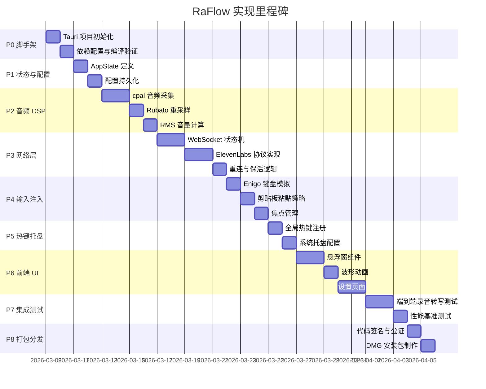

### 1.2 阶段依赖关系图

```mermaid
graph LR
    P0["P0\n脚手架"] --> P1["P1\n状态/配置"]
    P1 --> P2["P2\n音频 DSP"]
    P1 --> P3["P3\n网络层"]
    P2 --> P3
    P3 --> P4["P4\n输入注入"]
    P1 --> P5["P5\n热键/托盘"]
    P4 --> P6["P6\n前端 UI"]
    P5 --> P6
    P3 --> P6
    P6 --> P7["P7\n集成测试"]
    P7 --> P8["P8\n打包分发"]

    style P0 fill:#4a90d9
    style P1 fill:#4a90d9
    style P2 fill:#e67e22
    style P3 fill:#e67e22
    style P4 fill:#27ae60
    style P5 fill:#27ae60
    style P6 fill:#8e44ad
    style P7 fill:#c0392b
    style P8 fill:#2c3e50
```

### 1.3 技术风险评估

| 风险项 | 实现难度 | 业务影响 | 象限 | 应对策略 |
|--------|---------|---------|------|---------|
| macOS 焦点管理 | ⬛⬛⬛⬛ 高 | 🔴🔴🔴🔴 高 | 🚨 重点攻关 | 优先 POC 验证 NSPanel nonactivatingPanel |
| 音频线程无锁设计 | ⬛⬛⬛ 高 | 🔴🔴🔴🔴 高 | 🚨 重点攻关 | 严格使用 try_send + 丢帧策略 |
| WebSocket 重连 | ⬛⬛ 中 | 🔴🔴🔴🔴 高 | ⚠️ 提前验证 | 指数退避 + previous_text 恢复上下文 |
| enigo API 破坏性变更 | ⬛⬛ 中 | 🔴🔴🔴 较高 | ⚠️ 提前验证 | 锁定 enigo 0.6，写兼容适配层 |
| Rubato 重采样参数调优 | ⬛⬛⬛ 高 | 🔴🔴🔴 中 | ⚠️ 提前验证 | 提前用真实麦克风数据做音质测试 |
| Tauri 权限 ACL 配置 | ⬛⬛ 中 | 🔴🔴 中 | 📋 按计划推进 | 参考官方 capabilities 示例 |
| macOS App Nap 问题 | ⬛⬛ 中 | 🔴🔴 中 | 📋 按计划推进 | macOSPrivateApi: true + 后台任务保活 |
| 前端波形动画性能 | ⬛ 低 | 🔴 低 | ✅ 低优先级 | requestAnimationFrame 节流即可 |

---

## 2. 阶段 P0：项目脚手架

### 2.1 初始化命令

```bash
# 1. 安装 Tauri CLI
cargo install tauri-cli --version "^2"

# 2. 创建项目（选择 React + TypeScript 前端模板）
cargo tauri init

# 或使用 create-tauri-app
npm create tauri-app@latest raflow -- \
  --template react-ts \
  --manager npm

# 3. 进入项目目录
cd raflow

# 4. 验证编译
cargo tauri dev
```

### 2.2 完整 Cargo.toml

```toml
[package]
name = "raflow"
version = "0.1.0"
edition = "2021"
rust-version = "1.85"

[lib]
name = "raflow_lib"
crate-type = ["staticlib", "cdylib", "rlib"]

[build-dependencies]
tauri-build = { version = "2.5", features = [] }

[dependencies]
# ─── Tauri 核心框架 ───
tauri = { version = "2.10", features = ["tray-icon", "protocol-asset"] }
tauri-plugin-global-shortcut = "2.3"
tauri-plugin-clipboard-manager = "2.3"
tauri-plugin-dialog = "2.2"
tauri-plugin-fs = "2.2"

# ─── 异步运行时与网络 ───
tokio = { version = "1", features = ["full"] }
tokio-tungstenite = { version = "0.28", features = ["rustls-tls-native-roots"] }
futures-util = "0.3"
serde = { version = "1", features = ["derive"] }
serde_json = "1"

# ─── 音频处理 ───
cpal = "0.17"
rubato = "0.16"

# ─── 编码工具 ───
base64 = "0.22"

# ─── 系统交互 ───
enigo = "0.6"
active-win-pos-rs = "0.9"

# ─── 错误处理与日志 ───
anyhow = "1"
thiserror = "2"
tracing = "0.1"
tracing-subscriber = { version = "0.3", features = ["env-filter", "json"] }

[target.'cfg(target_os = "macos")'.dependencies]
objc2 = "0.5"
core-foundation = "0.10"

[profile.release]
opt-level = 3
lto = true
codegen-units = 1
strip = true
```

### 2.3 tauri.conf.json 完整配置

```json
{
  "$schema": "https://schema.tauri.app/config/2",
  "productName": "RaFlow",
  "version": "0.1.0",
  "identifier": "com.raflow.app",
  "build": {
    "frontendDist": "../dist",
    "devUrl": "http://localhost:1420",
    "beforeDevCommand": "npm run dev",
    "beforeBuildCommand": "npm run build"
  },
  "app": {
    "withGlobalTauri": true,
    "macOSPrivateApi": true,
    "trayIcon": {
      "iconPath": "icons/tray.png",
      "iconAsTemplate": true
    },
    "windows": [
      {
        "label": "main",
        "title": "RaFlow",
        "width": 520,
        "height": 680,
        "resizable": false,
        "visible": false,
        "center": true,
        "titleBarStyle": "Overlay"
      },
      {
        "label": "overlay",
        "title": "",
        "width": 420,
        "height": 90,
        "decorations": false,
        "transparent": true,
        "alwaysOnTop": true,
        "skipTaskbar": true,
        "visible": false,
        "resizable": false,
        "shadow": false,
        "focus": false,
        "acceptFirstMouse": false
      }
    ]
  },
  "bundle": {
    "active": true,
    "targets": "all",
    "icon": [
      "icons/32x32.png",
      "icons/128x128.png",
      "icons/128x128@2x.png",
      "icons/icon.icns",
      "icons/icon.ico"
    ],
    "macOS": {
      "entitlements": "entitlements.plist",
      "signingIdentity": null,
      "minimumSystemVersion": "13.0"
    }
  }
}
```

### 2.4 macOS 权限 entitlements.plist

```xml
<?xml version="1.0" encoding="UTF-8"?>
<!DOCTYPE plist PUBLIC "-//Apple//DTD PLIST 1.0//EN"
  "http://www.apple.com/DTDs/PropertyList-1.0.dtd">
<plist version="1.0">
<dict>
  <!-- 麦克风录音权限 -->
  <key>com.apple.security.device.audio-input</key>
  <true/>
  <!-- 辅助功能权限（键盘模拟输入） -->
  <key>com.apple.security.automation.apple-events</key>
  <true/>
  <!-- 网络访问权限（WebSocket 连接 ElevenLabs） -->
  <key>com.apple.security.network.client</key>
  <true/>
  <!-- App Sandbox 关闭（需要 Accessibility API） -->
  <key>com.apple.security.app-sandbox</key>
  <false/>
</dict>
</plist>
```

---

## 3. 阶段 P1：全局状态与配置

### 3.1 文件：`src-tauri/src/state.rs`

```rust
use std::sync::{Arc, Mutex, RwLock};
use tokio::sync::mpsc;
use tokio::task::AbortHandle;
use serde::{Deserialize, Serialize};

/// 应用全局状态，通过 Tauri manage() 注入
pub struct AppState {
    /// 当前是否正在录音
    pub recording: Arc<Mutex<bool>>,
    /// ElevenLabs API Key（内存中明文，启动时从加密存储解密）
    pub api_key: Arc<RwLock<String>>,
    /// WebSocket 连接状态
    pub ws_status: Arc<Mutex<WsStatus>>,
    /// 向 DSP 线程发送停止信号
    pub audio_stop_tx: Arc<Mutex<Option<mpsc::Sender<()>>>>,
    /// WebSocket 任务的取消句柄
    pub ws_abort: Arc<Mutex<Option<AbortHandle>>>,
    /// 用户配置
    pub config: Arc<RwLock<AppConfig>>,
}

impl AppState {
    pub fn new() -> Self {
        Self {
            recording: Arc::new(Mutex::new(false)),
            api_key: Arc::new(RwLock::new(String::new())),
            ws_status: Arc::new(Mutex::new(WsStatus::Disconnected)),
            audio_stop_tx: Arc::new(Mutex::new(None)),
            ws_abort: Arc::new(Mutex::new(None)),
            config: Arc::new(RwLock::new(AppConfig::default())),
        }
    }
}

#[derive(Debug, Clone, Serialize, Deserialize, PartialEq)]
#[serde(rename_all = "snake_case")]
pub enum WsStatus {
    Disconnected,
    Connecting,
    Connected,
    Reconnecting,
    Error(String),
}

#[derive(Debug, Clone, Serialize, Deserialize)]
pub struct AppConfig {
    pub api_key: String,
    pub hotkey: String,
    /// "vad" | "manual"
    pub commit_strategy: String,
    pub vad_silence_secs: f32,
    pub vad_threshold: f32,
    /// None = 自动检测
    pub language_code: Option<String>,
    /// "hybrid" | "keyboard" | "clipboard"
    pub injection_strategy: String,
    /// 字符数阈值，超过此值使用剪贴板注入
    pub short_text_threshold: usize,
    pub include_timestamps: bool,
}

impl Default for AppConfig {
    fn default() -> Self {
        Self {
            api_key: String::new(),
            hotkey: "CmdOrCtrl+Shift+Space".into(),
            commit_strategy: "vad".into(),
            vad_silence_secs: 1.5,
            vad_threshold: 0.4,
            language_code: None,
            injection_strategy: "hybrid".into(),
            short_text_threshold: 20,
            include_timestamps: false,
        }
    }
}
```

### 3.2 文件：`src-tauri/src/commands.rs`（配置相关）

```rust
use tauri::{AppHandle, Manager, State};
use crate::state::{AppConfig, AppState, WsStatus};

/// 保存用户配置到本地文件
#[tauri::command]
pub async fn save_config(
    config: AppConfig,
    state: State<'_, AppState>,
    app: AppHandle,
) -> Result<(), String> {
    // 1. 更新内存中的 API Key
    {
        let mut key = state.api_key.write().unwrap();
        *key = config.api_key.clone();
    }

    // 2. 更新内存配置
    {
        let mut cfg = state.config.write().unwrap();
        *cfg = config.clone();
    }

    // 3. 持久化（写入 app data 目录的 config.json）
    let config_dir = app.path().app_config_dir()
        .map_err(|e| e.to_string())?;
    std::fs::create_dir_all(&config_dir).map_err(|e| e.to_string())?;

    // 注意：实际存储时应对 api_key 字段加密
    // 简化示例：直接序列化（生产环境需接入 Keychain）
    let json = serde_json::to_string_pretty(&config)
        .map_err(|e| e.to_string())?;
    std::fs::write(config_dir.join("config.json"), json)
        .map_err(|e| e.to_string())?;

    Ok(())
}

/// 读取配置
#[tauri::command]
pub async fn get_config(state: State<'_, AppState>) -> Result<AppConfig, String> {
    let cfg = state.config.read().unwrap().clone();
    Ok(cfg)
}

/// 获取 WebSocket 当前状态
#[tauri::command]
pub async fn get_ws_status(state: State<'_, AppState>) -> Result<WsStatus, String> {
    let status = state.ws_status.lock().unwrap().clone();
    Ok(status)
}
```

### 3.3 配置加载流程

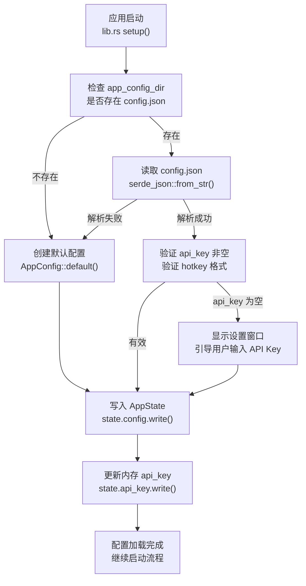

---

## 4. 阶段 P2：音频采集与 DSP 流水线

### 4.1 文件：`src-tauri/src/audio/capture.rs`

```rust
use cpal::traits::{DeviceTrait, HostTrait, StreamTrait};
use cpal::{SampleFormat, Stream, StreamConfig};
use std::sync::mpsc as std_mpsc;
use tracing::{error, info};

pub struct AudioCapture {
    stream: Stream,
}

impl AudioCapture {
    /// 初始化音频采集，返回 AudioCapture 句柄和原始 PCM 数据接收端
    ///
    /// - `raw_tx`: 向 DSP 线程传输 f32 PCM 数据的发送端
    pub fn new(raw_tx: std_mpsc::SyncSender<Vec<f32>>) -> anyhow::Result<Self> {
        let host = cpal::default_host();
        let device = host
            .default_input_device()
            .ok_or_else(|| anyhow::anyhow!("没有找到可用的麦克风设备"))?;

        info!("使用音频设备: {}", device.name()?);

        let supported_config = device.default_input_config()?;
        let sample_format = supported_config.sample_format();
        let config: StreamConfig = supported_config.into();

        info!(
            "音频配置: 采样率={}Hz, 通道数={}, 格式={:?}",
            config.sample_rate.0, config.channels, sample_format
        );

        let err_fn = |err| error!("音频流错误: {}", err);

        // 根据设备支持的采样格式分发
        let stream = match sample_format {
            SampleFormat::F32 => build_stream_f32(&device, &config, raw_tx, err_fn)?,
            SampleFormat::I16 => build_stream_i16(&device, &config, raw_tx, err_fn)?,
            SampleFormat::U16 => build_stream_u16(&device, &config, raw_tx, err_fn)?,
            fmt => anyhow::bail!("不支持的采样格式: {:?}", fmt),
        };

        stream.play()?;
        Ok(Self { stream })
    }
}

fn build_stream_f32(
    device: &cpal::Device,
    config: &StreamConfig,
    tx: std_mpsc::SyncSender<Vec<f32>>,
    err_fn: impl Fn(cpal::StreamError) + Send + 'static,
) -> anyhow::Result<Stream> {
    let stream = device.build_input_stream(
        config,
        move |data: &[f32], _: &cpal::InputCallbackInfo| {
            // ⚠️ 高优先级音频线程：只做最小化操作
            // SyncSender 的 try_send 是非阻塞的，容量满则丢帧（可接受）
            let _ = tx.try_send(data.to_vec());
        },
        err_fn,
        None,
    )?;
    Ok(stream)
}

fn build_stream_i16(
    device: &cpal::Device,
    config: &StreamConfig,
    tx: std_mpsc::SyncSender<Vec<f32>>,
    err_fn: impl Fn(cpal::StreamError) + Send + 'static,
) -> anyhow::Result<Stream> {
    let stream = device.build_input_stream(
        config,
        move |data: &[i16], _: &cpal::InputCallbackInfo| {
            let floats: Vec<f32> = data.iter().map(|&s| s as f32 / 32768.0).collect();
            let _ = tx.try_send(floats);
        },
        err_fn,
        None,
    )?;
    Ok(stream)
}

fn build_stream_u16(
    device: &cpal::Device,
    config: &StreamConfig,
    tx: std_mpsc::SyncSender<Vec<f32>>,
    err_fn: impl Fn(cpal::StreamError) + Send + 'static,
) -> anyhow::Result<Stream> {
    let stream = device.build_input_stream(
        config,
        move |data: &[u16], _: &cpal::InputCallbackInfo| {
            let floats: Vec<f32> = data.iter()
                .map(|&s| (s as f32 - 32768.0) / 32768.0)
                .collect();
            let _ = tx.try_send(floats);
        },
        err_fn,
        None,
    )?;
    Ok(stream)
}

/// 获取当前系统默认麦克风的原生采样率和通道数
pub fn get_device_config() -> anyhow::Result<(u32, u16)> {
    let host = cpal::default_host();
    let device = host
        .default_input_device()
        .ok_or_else(|| anyhow::anyhow!("无麦克风"))?;
    let config = device.default_input_config()?;
    Ok((config.sample_rate().0, config.channels()))
}
```

### 4.2 文件：`src-tauri/src/audio/resampler.rs`

```rust
use rubato::{
    Resampler, SincFixedIn, SincInterpolationParameters,
    SincInterpolationType, WindowFunction,
};
use std::sync::mpsc as std_mpsc;
use tokio::sync::mpsc as tokio_mpsc;
use tracing::warn;

const TARGET_SAMPLE_RATE: u32 = 16_000;
/// 每次向 WebSocket 发送的帧数（100ms @ 16kHz）
const CHUNK_FRAMES: usize = 1_600;

/// DSP 处理线程：在独立的 std::thread 中运行
/// - 输入: 来自 cpal 回调的 f32 多声道原始数据（raw_rx）
/// - 输出: 重采样后的 i16 单声道 PCM，每次 1600 帧（out_tx）
pub fn run_dsp_thread(
    raw_rx: std_mpsc::Receiver<Vec<f32>>,
    out_tx: tokio_mpsc::Sender<Vec<i16>>,
    native_sample_rate: u32,
    channels: usize,
    rms_tx: tokio_mpsc::Sender<f32>,
) {
    std::thread::Builder::new()
        .name("raflow-dsp".into())
        .spawn(move || {
            // ─── 构建 Sinc 重采样器 ───
            let sinc_params = SincInterpolationParameters {
                sinc_len: 256,
                f_cutoff: 0.95,
                interpolation: SincInterpolationType::Linear,
                oversampling_factor: 256,
                window: WindowFunction::BlackmanHarris2,
            };

            let resample_ratio = TARGET_SAMPLE_RATE as f64 / native_sample_rate as f64;

            let mut resampler = SincFixedIn::<f32>::new(
                resample_ratio,
                2.0,   // 允许最大 2x 比率波动（用于变速语音）
                sinc_params,
                // 每次处理的输入帧数：对应输出 CHUNK_FRAMES 帧
                (CHUNK_FRAMES as f64 / resample_ratio) as usize,
                1,     // 单声道（已下混）
            )
            .expect("重采样器初始化失败");

            let mut mono_buffer: Vec<f32> = Vec::with_capacity(8192);
            let mut output_buffer: Vec<i16> = Vec::with_capacity(CHUNK_FRAMES * 2);

            loop {
                // 阻塞等待音频数据
                let raw = match raw_rx.recv() {
                    Ok(v) => v,
                    Err(_) => break, // 发送端关闭，退出线程
                };

                // 计算 RMS 音量（在下混前）
                let rms = compute_rms(&raw);
                let _ = rms_tx.try_send(rms);

                // ─── 立体声 → 单声道（平均）───
                let mono: Vec<f32> = if channels == 1 {
                    raw
                } else {
                    raw.chunks(channels)
                        .map(|ch| ch.iter().sum::<f32>() / channels as f32)
                        .collect()
                };

                mono_buffer.extend_from_slice(&mono);

                // ─── 积累足够的帧后批量重采样 ───
                let input_frames_needed = resampler.input_frames_next();

                while mono_buffer.len() >= input_frames_needed {
                    let input_chunk: Vec<f32> = mono_buffer.drain(..input_frames_needed).collect();

                    match resampler.process(&[input_chunk], None) {
                        Ok(resampled) => {
                            // resampled[0] 是单声道输出
                            let i16_samples: Vec<i16> = resampled[0]
                                .iter()
                                .map(|&x| (x.clamp(-1.0, 1.0) * 32767.0) as i16)
                                .collect();
                            output_buffer.extend_from_slice(&i16_samples);
                        }
                        Err(e) => {
                            warn!("重采样失败: {}", e);
                        }
                    }

                    // 积累 CHUNK_FRAMES 后发送一批
                    while output_buffer.len() >= CHUNK_FRAMES {
                        let chunk: Vec<i16> = output_buffer.drain(..CHUNK_FRAMES).collect();
                        if out_tx.blocking_send(chunk).is_err() {
                            return; // 接收端关闭
                        }
                    }
                }
            }
        })
        .expect("DSP 线程启动失败");
}

/// 计算 RMS 音量，返回 0.0~1.0
fn compute_rms(samples: &[f32]) -> f32 {
    if samples.is_empty() {
        return 0.0;
    }
    let mean_sq = samples.iter().map(|&x| x * x).sum::<f32>() / samples.len() as f32;
    mean_sq.sqrt()
}
```

### 4.3 音频线程数据流

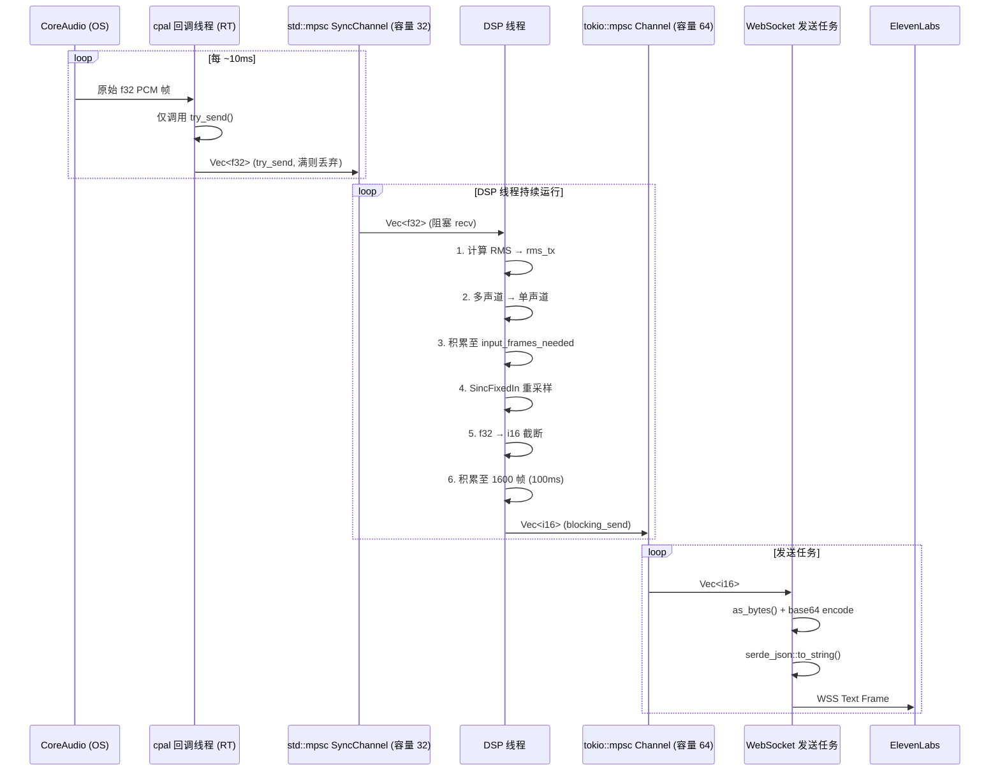

---

## 5. 阶段 P3：ElevenLabs WebSocket 网络层

### 5.1 文件：`src-tauri/src/network/protocol.rs`

```rust
use serde::{Deserialize, Serialize};

// ═══════════════════════════════════════
//  上行消息（客户端 → ElevenLabs）
// ═══════════════════════════════════════

#[derive(Serialize)]
pub struct AudioChunkMessage {
    pub message_type: &'static str,
    pub audio_base_64: String,
    #[serde(skip_serializing_if = "Option::is_none")]
    pub commit: Option<bool>,
    #[serde(skip_serializing_if = "Option::is_none")]
    pub previous_text: Option<String>,
}

impl AudioChunkMessage {
    pub fn new(audio_base_64: String) -> Self {
        Self {
            message_type: "input_audio_chunk",
            audio_base_64,
            commit: None,
            previous_text: None,
        }
    }
}

// ═══════════════════════════════════════
//  下行消息（ElevenLabs → 客户端）
// ═══════════════════════════════════════

/// 统一事件枚举，通过 message_type 字段反序列化
#[derive(Deserialize, Debug)]
#[serde(tag = "message_type", rename_all = "snake_case")]
pub enum ScribeEvent {
    SessionStarted(SessionStarted),
    PartialTranscript(TranscriptEvent),
    CommittedTranscript(TranscriptEvent),
    CommittedTranscriptWithTimestamps(TimestampedTranscript),
    InputError(InputError),
    #[serde(other)]
    Unknown,
}

#[derive(Deserialize, Debug)]
pub struct SessionStarted {
    pub session_id: String,
    pub config: SessionConfig,
}

#[derive(Deserialize, Debug)]
pub struct SessionConfig {
    pub sample_rate: u32,
    pub model_id: String,
    pub language_code: Option<String>,
}

#[derive(Deserialize, Debug, Clone)]
pub struct TranscriptEvent {
    pub text: String,
}

#[derive(Deserialize, Debug)]
pub struct TimestampedTranscript {
    pub text: String,
    pub language_code: Option<String>,
    pub words: Vec<WordToken>,
}

#[derive(Deserialize, Debug)]
pub struct WordToken {
    pub text: String,
    pub start: f64,
    pub end: f64,
    #[serde(rename = "type")]
    pub token_type: String,
    pub logprob: Option<f64>,
}

#[derive(Deserialize, Debug)]
pub struct InputError {
    pub error_message: String,
}

// ═══════════════════════════════════════
//  前端 Event Payload（emit 到 WebView）
// ═══════════════════════════════════════

#[derive(Serialize, Clone)]
pub struct TranscriptPayload {
    pub text: String,
    pub is_final: bool,
}

#[derive(Serialize, Clone)]
pub struct AudioLevelPayload {
    pub rms: f32,
    /// 归一化到 0.0 ~ 1.0
    pub normalized: f32,
}

#[derive(Serialize, Clone)]
pub struct WsStatusPayload {
    pub status: String,
    pub error: Option<String>,
}
```

### 5.2 文件：`src-tauri/src/network/scribe_client.rs`

```rust
use anyhow::Result;
use base64::{engine::general_purpose::STANDARD as B64, Engine};
use futures_util::{SinkExt, StreamExt};
use std::time::Duration;
use tauri::{AppHandle, Manager};
use tokio::sync::mpsc;
use tokio::time::sleep;
use tokio_tungstenite::{
    connect_async_tls_with_config,
    tungstenite::{
        client::IntoClientRequest,
        Message,
    },
};
use tracing::{error, info, warn};

use crate::network::protocol::*;
use crate::state::{AppState, WsStatus};

const WS_ENDPOINT: &str = "wss://api.elevenlabs.io/v1/speech-to-text/realtime";
const MAX_RECONNECT_ATTEMPTS: u32 = 5;
const KEEPALIVE_INTERVAL_SECS: u64 = 15;

pub struct ScribeSession {
    pub text_tx: mpsc::Sender<String>, // 已提交文本 → 输入注入
}

/// 启动完整的 WebSocket 会话（发送 + 接收 + 保活）
/// 返回 ScribeSession 和用于发送音频数据的 channel
pub async fn start_session(
    api_key: String,
    config: SessionParams,
    audio_rx: mpsc::Receiver<Vec<i16>>,
    text_tx: mpsc::Sender<String>,
    app: AppHandle,
) -> Result<()> {
    let mut attempt = 0u32;
    let mut reconnect_delay = Duration::from_secs(1);

    loop {
        emit_ws_status(&app, WsStatus::Connecting, None);

        match connect_and_run(
            &api_key,
            &config,
            &app,
            &text_tx,
        )
        .await
        {
            Ok(_) => {
                // 正常结束（外部取消）
                emit_ws_status(&app, WsStatus::Disconnected, None);
                break;
            }
            Err(e) => {
                attempt += 1;
                if attempt > MAX_RECONNECT_ATTEMPTS {
                    let msg = format!("重连失败超过 {} 次: {}", MAX_RECONNECT_ATTEMPTS, e);
                    error!("{}", msg);
                    emit_ws_status(&app, WsStatus::Error(msg.clone()), Some(msg));
                    break;
                }
                warn!("连接断开，{}s 后第 {} 次重连: {}", reconnect_delay.as_secs(), attempt, e);
                emit_ws_status(&app, WsStatus::Reconnecting, None);
                sleep(reconnect_delay).await;
                reconnect_delay = (reconnect_delay * 2).min(Duration::from_secs(16));
            }
        }
    }
    Ok(())
}

/// 建立单次 WebSocket 连接并运行发送/接收循环
async fn connect_and_run(
    api_key: &str,
    config: &SessionParams,
    app: &AppHandle,
    text_tx: &mpsc::Sender<String>,
) -> Result<()> {
    // ─── 构造连接 URL（含查询参数）───
    let url = build_url(config);
    let mut request = url.into_client_request()?;

    // ─── 注入认证 Header ───
    request.headers_mut().insert(
        "xi-api-key",
        api_key.parse()?,
    );

    info!("正在连接 ElevenLabs Scribe: {}", WS_ENDPOINT);
    let (ws_stream, _) = connect_async_tls_with_config(request, None, false, None).await?;
    info!("WebSocket 连接建立成功");

    let (mut ws_write, mut ws_read) = ws_stream.split();

    emit_ws_status(app, WsStatus::Connected, None);

    // ─── 并发运行三个任务 ───
    tokio::select! {
        // 保活 Ping
        _ = keepalive_task(&mut ws_write) => {},
        // 接收服务端消息
        r = receive_task(&mut ws_read, app, text_tx) => { r?; },
    }

    Ok(())
}

async fn keepalive_task(
    ws_write: &mut futures_util::stream::SplitSink<
        tokio_tungstenite::WebSocketStream<
            tokio_tungstenite::MaybeTlsStream<tokio::net::TcpStream>
        >,
        Message,
    >,
) {
    loop {
        sleep(Duration::from_secs(KEEPALIVE_INTERVAL_SECS)).await;
        if ws_write.send(Message::Ping(vec![])).await.is_err() {
            break;
        }
    }
}

async fn receive_task(
    ws_read: &mut futures_util::stream::SplitStream<
        tokio_tungstenite::WebSocketStream<
            tokio_tungstenite::MaybeTlsStream<tokio::net::TcpStream>
        >,
    >,
    app: &AppHandle,
    text_tx: &mpsc::Sender<String>,
) -> Result<()> {
    while let Some(msg) = ws_read.next().await {
        let msg = msg?;
        match msg {
            Message::Text(text) => {
                handle_server_message(&text, app, text_tx).await;
            }
            Message::Pong(_) => {
                // 保活响应，忽略
            }
            Message::Close(_) => {
                info!("服务端主动关闭连接");
                break;
            }
            _ => {}
        }
    }
    Ok(())
}

async fn handle_server_message(
    text: &str,
    app: &AppHandle,
    text_tx: &mpsc::Sender<String>,
) {
    match serde_json::from_str::<ScribeEvent>(text) {
        Ok(event) => match event {
            ScribeEvent::SessionStarted(s) => {
                info!("会话建立: session_id={}", s.session_id);
                emit_ws_status(app, WsStatus::Connected, None);
            }
            ScribeEvent::PartialTranscript(t) => {
                let _ = app.emit("partial-transcript", TranscriptPayload {
                    text: t.text,
                    is_final: false,
                });
            }
            ScribeEvent::CommittedTranscript(t) => {
                let text = t.text.clone();
                let _ = app.emit("committed-transcript", TranscriptPayload {
                    text: text.clone(),
                    is_final: true,
                });
                let _ = text_tx.send(text).await;
            }
            ScribeEvent::InputError(e) => {
                error!("ElevenLabs 输入错误: {}", e.error_message);
                let _ = app.emit("api-error", e.error_message);
            }
            _ => {}
        },
        Err(e) => {
            warn!("无法解析服务端消息: {} | 原文: {}", e, &text[..100.min(text.len())]);
        }
    }
}

/// 音频发送任务：将 Vec<i16> 编码为 Base64 JSON 发送
pub async fn audio_sender_task(
    mut ws_write: impl SinkExt<Message, Error = tokio_tungstenite::tungstenite::Error> + Unpin,
    mut audio_rx: mpsc::Receiver<Vec<i16>>,
) {
    while let Some(chunk) = audio_rx.recv().await {
        // i16 → 字节切片（小端序）
        let bytes: Vec<u8> = chunk.iter()
            .flat_map(|&s| s.to_le_bytes())
            .collect();

        let encoded = B64.encode(&bytes);
        let msg = AudioChunkMessage::new(encoded);

        if let Ok(json) = serde_json::to_string(&msg) {
            if ws_write.send(Message::Text(json)).await.is_err() {
                break;
            }
        }
    }
}

pub struct SessionParams {
    pub language_code: Option<String>,
    pub commit_strategy: String,
    pub vad_silence_secs: f32,
    pub vad_threshold: f32,
    pub include_timestamps: bool,
}

fn build_url(params: &SessionParams) -> String {
    let mut url = format!(
        "{}?model_id=scribe_v2_realtime&encoding=pcm_s16le_16&sample_rate=16000",
        WS_ENDPOINT
    );
    if let Some(lang) = &params.language_code {
        url.push_str(&format!("&language_code={}", lang));
    }
    url.push_str(&format!("&commit_strategy={}", params.commit_strategy));
    url.push_str(&format!("&vad_silence_threshold_secs={}", params.vad_silence_secs));
    url.push_str(&format!("&vad_threshold={}", params.vad_threshold));
    if params.include_timestamps {
        url.push_str("&include_timestamps=true");
    }
    url
}

fn emit_ws_status(app: &AppHandle, status: WsStatus, error: Option<String>) {
    let status_str = match &status {
        WsStatus::Disconnected => "disconnected",
        WsStatus::Connecting => "connecting",
        WsStatus::Connected => "connected",
        WsStatus::Reconnecting => "reconnecting",
        WsStatus::Error(_) => "error",
    };
    let _ = app.emit("ws-status", WsStatusPayload {
        status: status_str.into(),
        error,
    });
    if let Ok(mut s) = app.state::<AppState>().ws_status.lock() {
        *s = status;
    }
}
```

### 5.3 WebSocket 重连状态转换图

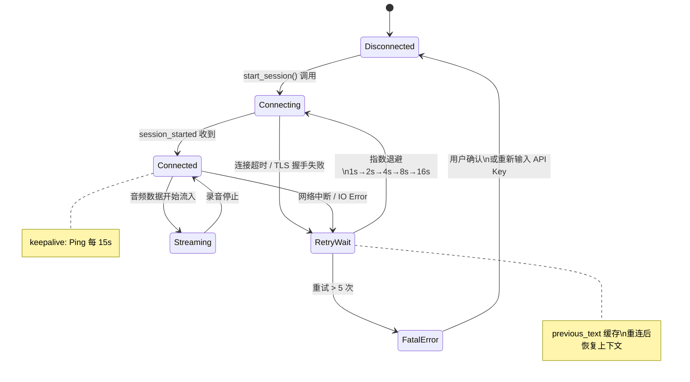

---

## 6. 阶段 P4：系统输入注入模块

### 6.1 文件：`src-tauri/src/input/injector.rs`

```rust
use anyhow::Result;
use enigo::{Direction, Enigo, Key, Keyboard, Settings};
use std::time::Duration;
use tauri::{AppHandle, Manager};
use tokio::sync::mpsc;
use tokio::time::sleep;
use tracing::{info, warn};

use crate::input::window_ctx::get_active_window_info;
use crate::state::AppState;

/// 文本注入监听任务
/// - 监听来自 ScribeClient 的 committed_transcript 文本
/// - 根据配置选择注入策略执行
pub async fn input_executor_task(
    mut text_rx: mpsc::Receiver<String>,
    app: AppHandle,
) {
    while let Some(text) = text_rx.recv().await {
        if text.trim().is_empty() {
            continue;
        }

        let config = {
            let state = app.state::<AppState>();
            state.config.read().unwrap().clone()
        };

        // 隐藏悬浮窗，将焦点归还给目标应用
        if let Some(overlay) = app.get_webview_window("overlay") {
            let _ = overlay.hide();
            // 等待 macOS 完成窗口切换
            sleep(Duration::from_millis(80)).await;
        }

        let result = match config.injection_strategy.as_str() {
            "keyboard" => inject_keyboard(&text),
            "clipboard" => inject_clipboard(&text, &app).await,
            "hybrid" | _ => {
                if text.len() < config.short_text_threshold {
                    inject_keyboard(&text)
                } else {
                    inject_clipboard(&text, &app).await
                }
            }
        };

        if let Err(e) = result {
            warn!("文本注入失败: {}，降级为剪贴板模式", e);
            let _ = inject_clipboard(&text, &app).await;
        }

        info!("文本注入完成: {:?}", &text[..20.min(text.len())]);
    }
}

/// 键盘模拟注入（enigo 0.6 新 API）
fn inject_keyboard(text: &str) -> Result<()> {
    let mut enigo = Enigo::new(&Settings::default())
        .map_err(|e| anyhow::anyhow!("Enigo 初始化失败: {:?}", e))?;
    enigo.text(text)
        .map_err(|e| anyhow::anyhow!("键盘输入失败: {:?}", e))?;
    Ok(())
}

/// 剪贴板混合注入
/// 步骤：备份剪贴板 → 写入文本 → Cmd+V → 等待 → 恢复剪贴板
async fn inject_clipboard(text: &str, app: &AppHandle) -> Result<()> {
    use tauri_plugin_clipboard_manager::ClipboardExt;

    let clipboard = app.clipboard();

    // 1. 备份当前剪贴板内容
    let backup = clipboard.read_text().unwrap_or_default();

    // 2. 写入转写文本
    clipboard.write_text(text.to_string())
        .map_err(|e| anyhow::anyhow!("剪贴板写入失败: {}", e))?;

    // 3. 短暂等待剪贴板更新
    sleep(Duration::from_millis(30)).await;

    // 4. 发送 Cmd+V（macOS）/ Ctrl+V（其他）
    let mut enigo = Enigo::new(&Settings::default())
        .map_err(|e| anyhow::anyhow!("Enigo 初始化失败: {:?}", e))?;

    #[cfg(target_os = "macos")]
    {
        enigo.key(Key::Meta, Direction::Press)
            .map_err(|e| anyhow::anyhow!("{:?}", e))?;
        enigo.key(Key::Unicode('v'), Direction::Click)
            .map_err(|e| anyhow::anyhow!("{:?}", e))?;
        enigo.key(Key::Meta, Direction::Release)
            .map_err(|e| anyhow::anyhow!("{:?}", e))?;
    }
    #[cfg(not(target_os = "macos"))]
    {
        enigo.key(Key::Control, Direction::Press)?;
        enigo.key(Key::Unicode('v'), Direction::Click)?;
        enigo.key(Key::Control, Direction::Release)?;
    }

    // 5. 等待粘贴事件处理完成
    sleep(Duration::from_millis(150)).await;

    // 6. 恢复原始剪贴板内容
    if !backup.is_empty() {
        let _ = clipboard.write_text(backup);
    }

    Ok(())
}
```

### 6.2 文件：`src-tauri/src/input/window_ctx.rs`

```rust
use active_win_pos_rs::get_active_window;
use tracing::warn;

#[derive(Debug, Clone)]
pub struct WindowInfo {
    pub app_name: String,
    pub title: String,
    pub is_editable_guess: bool,
}

/// 获取当前活跃窗口信息
/// 注意：macOS 上获取 title 需要屏幕录制权限，无权限时 title 为空
pub fn get_active_window_info() -> WindowInfo {
    match get_active_window() {
        Ok(w) => {
            let app_name = w.app_name.clone();
            // 启发式判断：根据应用名推断是否为编辑类应用
            let is_editable = is_likely_editable_app(&app_name, &w.title);
            WindowInfo {
                app_name,
                title: w.title,
                is_editable_guess: is_editable,
            }
        }
        Err(_) => {
            warn!("无法获取活跃窗口信息");
            WindowInfo {
                app_name: String::new(),
                title: String::new(),
                is_editable_guess: true, // 未知时默认尝试注入
            }
        }
    }
}

/// 根据应用名和窗口标题启发式判断是否为可编辑区域
fn is_likely_editable_app(app_name: &str, _title: &str) -> bool {
    // 明确不适合注入的应用黑名单
    const BLACKLIST: &[&str] = &[
        "Finder",        // 文件管理器
        "Safari",        // 浏览器（视情况而定）
        "Preview",       // 预览
        "Photos",        // 照片
        "System Preferences",
        "System Settings",
    ];

    !BLACKLIST.iter().any(|&b| app_name.contains(b))
}
```

### 6.3 焦点管理流程

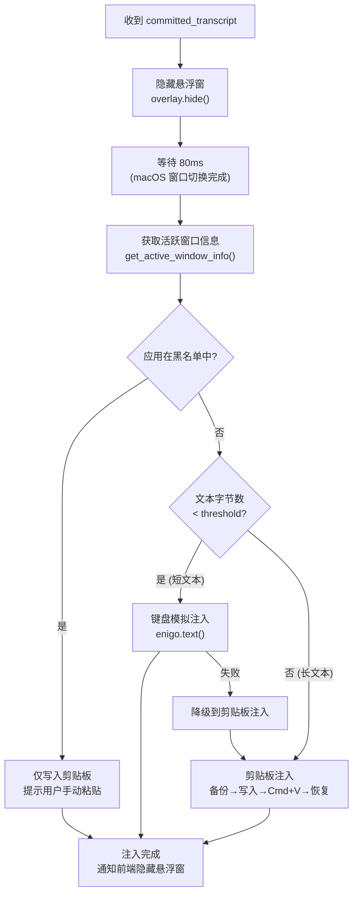

---

## 7. 阶段 P5：热键与系统托盘

### 7.1 文件：`src-tauri/src/lib.rs`（完整入口）

```rust
use tauri::{
    menu::{Menu, MenuItem},
    tray::TrayIconBuilder,
    Manager,
};
use tauri_plugin_global_shortcut::{GlobalShortcutExt, ShortcutState};
use tracing::info;

mod audio;
mod commands;
mod input;
mod network;
mod permissions;
mod state;

use state::AppState;

#[cfg_attr(mobile, tauri::mobile_entry_point)]
pub fn run() {
    // 初始化结构化日志
    tracing_subscriber::fmt()
        .with_env_filter("raflow=debug,warn")
        .init();

    tauri::Builder::default()
        // ─── 注册插件 ───
        .plugin(tauri_plugin_global_shortcut::Builder::new().build())
        .plugin(tauri_plugin_clipboard_manager::init())
        .plugin(tauri_plugin_dialog::init())
        .plugin(tauri_plugin_fs::init())
        // ─── 注册全局状态 ───
        .manage(AppState::new())
        // ─── 注册 Tauri Commands ───
        .invoke_handler(tauri::generate_handler![
            commands::start_recording,
            commands::stop_recording,
            commands::save_config,
            commands::get_config,
            commands::check_permissions,
            commands::get_ws_status,
        ])
        .setup(|app| {
            let app_handle = app.handle().clone();

            // ─── 加载配置 ───
            load_config(&app_handle);

            // ─── 注册全局热键 ───
            let shortcut_str = {
                let state = app.state::<AppState>();
                state.config.read().unwrap().hotkey.clone()
            };
            register_hotkey(app, &shortcut_str)?;

            // ─── 创建系统托盘 ───
            setup_tray(app)?;

            // ─── 检查 macOS 权限 ───
            #[cfg(target_os = "macos")]
            permissions::macos::check_and_request_permissions(&app_handle);

            Ok(())
        })
        .build(tauri::generate_context!())
        .expect("Tauri 应用构建失败")
        .run(|app_handle, event| {
            match event {
                // 拦截窗口关闭，改为隐藏（保持后台运行）
                tauri::RunEvent::WindowEvent {
                    label,
                    event: tauri::WindowEvent::CloseRequested { api, .. },
                    ..
                } => {
                    if label == "main" {
                        api.prevent_close();
                        if let Some(w) = app_handle.get_webview_window("main") {
                            let _ = w.hide();
                        }
                    }
                }
                _ => {}
            }
        });
}

fn register_hotkey(app: &tauri::App, shortcut: &str) -> anyhow::Result<()> {
    let app_handle = app.handle().clone();
    app.global_shortcut().on_shortcut(shortcut, move |_app, _shortcut, event| {
        if event.state == ShortcutState::Pressed {
            info!("全局热键触发");
            let handle = app_handle.clone();
            tauri::async_runtime::spawn(async move {
                let state = handle.state::<AppState>();
                let is_recording = *state.recording.lock().unwrap();
                if is_recording {
                    let _ = commands::stop_recording_internal(&handle).await;
                } else {
                    let _ = commands::start_recording_internal(&handle).await;
                }
            });
        }
    })?;
    info!("已注册全局热键: {}", shortcut);
    Ok(())
}

fn setup_tray(app: &tauri::App) -> anyhow::Result<()> {
    let quit = MenuItem::with_id(app, "quit", "退出 RaFlow", true, None::<&str>)?;
    let settings = MenuItem::with_id(app, "settings", "设置...", true, None::<&str>)?;
    let separator = tauri::menu::PredefinedMenuItem::separator(app)?;
    let menu = Menu::with_items(app, &[&settings, &separator, &quit])?;

    let app_handle = app.handle().clone();
    TrayIconBuilder::new()
        .menu(&menu)
        .tooltip("RaFlow - 语音输入")
        .on_menu_event(move |_app, event| match event.id().as_ref() {
            "quit" => {
                info!("用户选择退出");
                _app.exit(0);
            }
            "settings" => {
                if let Some(w) = app_handle.get_webview_window("main") {
                    let _ = w.show();
                    let _ = w.set_focus();
                }
            }
            _ => {}
        })
        .build(app)?;

    Ok(())
}

fn load_config(app: &tauri::AppHandle) {
    // 实现见 P1 阶段的配置加载流程
    if let Ok(config_dir) = app.path().app_config_dir() {
        let config_path = config_dir.join("config.json");
        if let Ok(content) = std::fs::read_to_string(&config_path) {
            if let Ok(config) = serde_json::from_str::<state::AppConfig>(&content) {
                let state = app.state::<AppState>();
                let api_key = config.api_key.clone();
                *state.config.write().unwrap() = config;
                *state.api_key.write().unwrap() = api_key;
                info!("配置加载成功");
                return;
            }
        }
    }
    info!("使用默认配置");
}
```

### 7.2 热键触发与录音启停流程

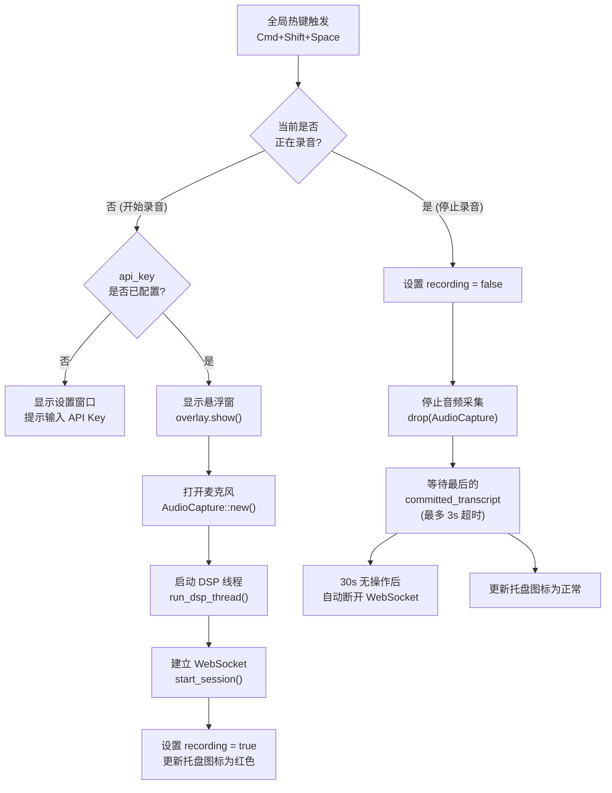

---

## 8. 阶段 P6：前端悬浮窗与设置页

### 8.1 文件：`src/components/Overlay/Overlay.tsx`

```tsx
import { useEffect, useRef, useState } from "react";
import { listen } from "@tauri-apps/api/event";
import { invoke } from "@tauri-apps/api/core";
import { Waveform } from "./Waveform";
import { TranscriptText } from "./TranscriptText";
import "./Overlay.css";

interface TranscriptPayload {
  text: string;
  is_final: boolean;
}

interface AudioLevelPayload {
  rms: number;
  normalized: number;
}

export function Overlay() {
  const [partial, setPartial] = useState("");
  const [committed, setCommitted] = useState("");
  const [audioLevel, setAudioLevel] = useState(0);
  const [isActive, setIsActive] = useState(false);
  const clearTimer = useRef<ReturnType<typeof setTimeout> | null>(null);

  useEffect(() => {
    // 监听 partial transcript（实时更新）
    const unPartial = listen<TranscriptPayload>("partial-transcript", (e) => {
      setPartial(e.payload.text);
      setIsActive(true);
    });

    // 监听 committed transcript（定稿）
    const unCommit = listen<TranscriptPayload>("committed-transcript", (e) => {
      setPartial("");
      setCommitted(e.payload.text);
      // 2s 后清空
      if (clearTimer.current) clearTimeout(clearTimer.current);
      clearTimer.current = setTimeout(() => {
        setCommitted("");
        setIsActive(false);
      }, 2000);
    });

    // 监听音量
    const unAudio = listen<AudioLevelPayload>("audio-level", (e) => {
      setAudioLevel(e.payload.normalized);
    });

    // 监听录音状态
    const unState = listen<{ recording: boolean }>("recording-state", (e) => {
      setIsActive(e.payload.recording);
      if (!e.payload.recording) {
        setPartial("");
        setAudioLevel(0);
      }
    });

    return () => {
      unPartial.then((f) => f());
      unCommit.then((f) => f());
      unAudio.then((f) => f());
      unState.then((f) => f());
    };
  }, []);

  return (
    <div className={`overlay-container ${isActive ? "active" : ""}`}>
      <Waveform level={audioLevel} />
      <TranscriptText partial={partial} committed={committed} />
    </div>
  );
}
```

### 8.2 文件：`src/components/Overlay/Waveform.tsx`

```tsx
import { useMemo } from "react";

interface Props {
  level: number; // 0.0 ~ 1.0
}

const BAR_COUNT = 8;

export function Waveform({ level }: Props) {
  // 生成 8 根柱状条，高度随音量波动
  const bars = useMemo(() => {
    return Array.from({ length: BAR_COUNT }, (_, i) => {
      // 中间的柱子更高（正态分布形状）
      const centerDist = Math.abs(i - (BAR_COUNT - 1) / 2) / ((BAR_COUNT - 1) / 2);
      const baseHeight = (1 - centerDist * 0.4) * level;
      // 添加少量随机抖动使动画更自然
      const jitter = (Math.random() - 0.5) * 0.15 * level;
      const height = Math.max(0.05, Math.min(1, baseHeight + jitter));
      return height;
    });
  }, [level]);

  return (
    <div className="waveform">
      {bars.map((h, i) => (
        <div
          key={i}
          className="waveform-bar"
          style={{
            height: `${h * 36}px`,
            opacity: 0.6 + h * 0.4,
          }}
        />
      ))}
    </div>
  );
}
```

### 8.3 文件：`src/components/Overlay/Overlay.css`

```css
/* 悬浮窗：透明背景，圆角毛玻璃 */
.overlay-container {
  width: 100%;
  height: 100%;
  display: flex;
  align-items: center;
  gap: 12px;
  padding: 0 16px;
  background: rgba(20, 20, 20, 0.75);
  backdrop-filter: blur(12px);
  -webkit-backdrop-filter: blur(12px);
  border-radius: 12px;
  border: 1px solid rgba(255, 255, 255, 0.12);
  box-sizing: border-box;
  opacity: 0;
  transform: translateY(8px);
  transition: opacity 0.15s ease, transform 0.15s ease;
}

.overlay-container.active {
  opacity: 1;
  transform: translateY(0);
}

/* 波形条 */
.waveform {
  display: flex;
  align-items: center;
  gap: 3px;
  height: 40px;
}

.waveform-bar {
  width: 4px;
  min-height: 4px;
  background: #ef4444;
  border-radius: 2px;
  transition: height 0.05s ease;
}

/* 转写文字 */
.transcript-text {
  flex: 1;
  font-size: 15px;
  font-family: -apple-system, BlinkMacSystemFont, "SF Pro Text", sans-serif;
  line-height: 1.4;
  overflow: hidden;
  max-height: 42px;
}

.transcript-partial {
  color: rgba(255, 255, 255, 0.55);
  font-style: italic;
}

.transcript-committed {
  color: rgba(255, 255, 255, 0.95);
  font-weight: 500;
}
```

### 8.4 前端组件通信图

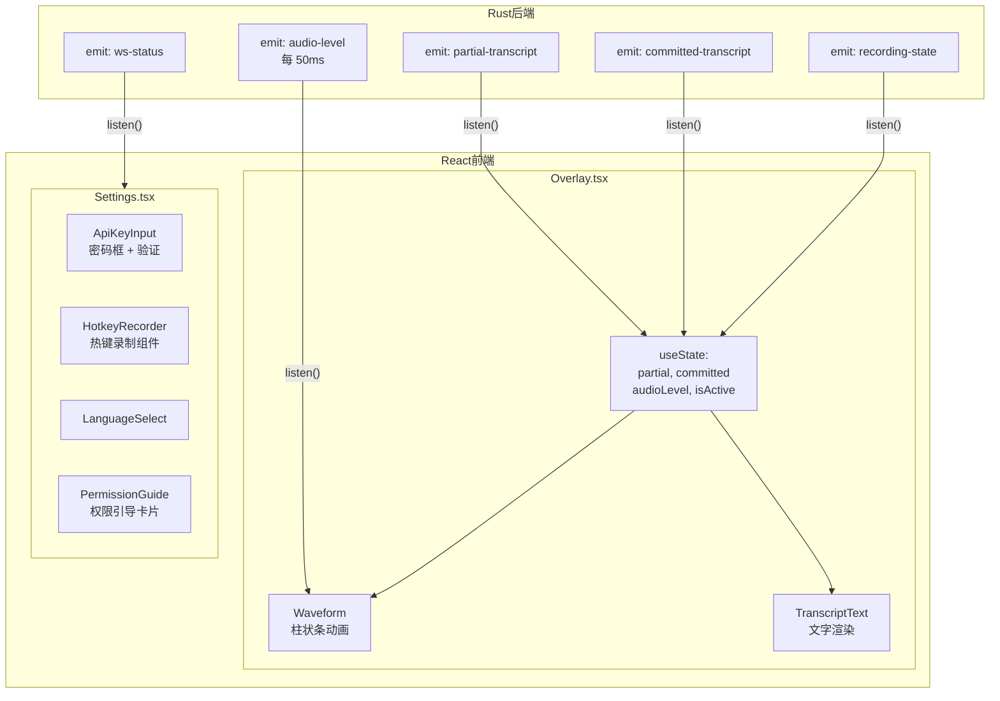

---

## 9. 阶段 P7：集成测试与端到端验证

### 9.1 测试策略

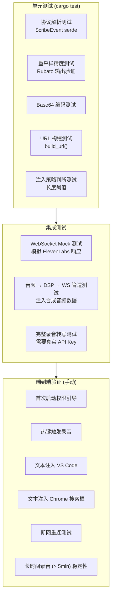

### 9.2 文件：`src-tauri/src/network/protocol_test.rs`

```rust
#[cfg(test)]
mod tests {
    use super::super::protocol::*;

    #[test]
    fn test_parse_session_started() {
        let json = r#"{
            "message_type": "session_started",
            "session_id": "abc123",
            "config": {
                "sample_rate": 16000,
                "model_id": "scribe_v2_realtime",
                "language_code": "en"
            }
        }"#;
        let event: ScribeEvent = serde_json::from_str(json).unwrap();
        assert!(matches!(event, ScribeEvent::SessionStarted(_)));
    }

    #[test]
    fn test_parse_partial_transcript() {
        let json = r#"{"message_type":"partial_transcript","text":"Hello"}"#;
        let event: ScribeEvent = serde_json::from_str(json).unwrap();
        if let ScribeEvent::PartialTranscript(t) = event {
            assert_eq!(t.text, "Hello");
        } else {
            panic!("期望 PartialTranscript");
        }
    }

    #[test]
    fn test_parse_committed_transcript() {
        let json = r#"{"message_type":"committed_transcript","text":"Hello World."}"#;
        let event: ScribeEvent = serde_json::from_str(json).unwrap();
        assert!(matches!(event, ScribeEvent::CommittedTranscript(_)));
    }

    #[test]
    fn test_parse_unknown_event() {
        let json = r#"{"message_type":"future_event","data":"x"}"#;
        let event: ScribeEvent = serde_json::from_str(json).unwrap();
        assert!(matches!(event, ScribeEvent::Unknown));
    }

    #[test]
    fn test_audio_chunk_serialization() {
        let msg = AudioChunkMessage::new("dGVzdA==".into());
        let json = serde_json::to_string(&msg).unwrap();
        assert!(json.contains("\"message_type\":\"input_audio_chunk\""));
        assert!(json.contains("\"audio_base_64\":\"dGVzdA==\""));
        // commit 字段不应出现（skip_serializing_if）
        assert!(!json.contains("commit"));
    }
}
```

### 9.3 性能测试检查清单

| 测试项 | 验证方法 | 通过标准 |
|-------|---------|---------|
| 音频回调延迟 | 在回调中计时，打印 p95/p99 | p99 < 5ms |
| DSP 处理延迟 | 测量 raw_rx → out_tx 时间 | p99 < 15ms |
| WebSocket 发送延迟 | Wireshark 抓包测量帧间隔 | 稳定 100ms ± 10ms |
| ElevenLabs 往返延迟 | partial_transcript 到达时间 | < 300ms |
| 内存泄漏检测 | 录音 5min 后对比内存 | 无线性增长 |
| CPU 占用（录音中） | Activity Monitor | < 5% (M1 Air) |

---

## 10. 阶段 P8：macOS 打包与分发

### 10.1 构建与签名流程

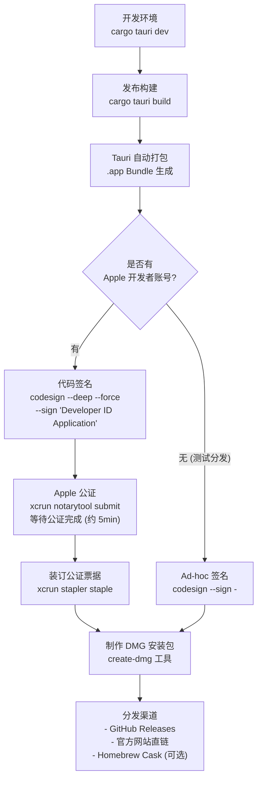

### 10.2 自动更新配置（可选）

```toml
# Cargo.toml 添加
[dependencies]
tauri-plugin-updater = "2.5"
```

```json
// tauri.conf.json 添加
{
  "plugins": {
    "updater": {
      "active": true,
      "dialog": true,
      "pubkey": "<YOUR_PUBLIC_KEY>",
      "endpoints": [
        "https://releases.raflow.app/{{target}}/{{arch}}/{{current_version}}"
      ]
    }
  }
}
```

### 10.3 发布检查清单

```
[ ] cargo clippy -- -D warnings 无错误
[ ] cargo test 所有单元测试通过
[ ] macOS 麦克风权限弹窗正常触发
[ ] macOS Accessibility 权限引导正常
[ ] 热键注册成功（系统偏好设置中可见）
[ ] 悬浮窗透明度和位置正常
[ ] 键盘注入到 VS Code 正常
[ ] 剪贴板注入到 Chrome 正常
[ ] App Nap 场景下后台不断连
[ ] DMG 安装包大小 < 15MB
[ ] 公证通过（xcrun stapler validate）
```

---

## 11. 任务依赖关系

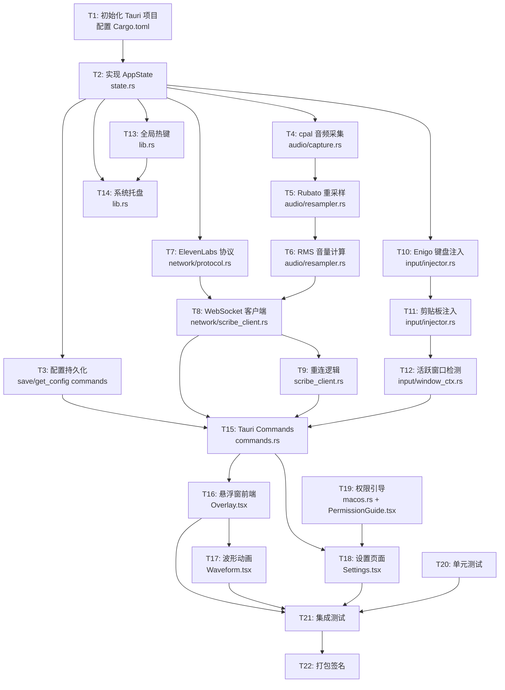

---

## 12. 关键接口契约

### 12.1 Tauri Commands 完整签名

```rust
// commands.rs 完整接口定义

/// 开始录音（热键触发或前端按钮）
#[tauri::command]
pub async fn start_recording(state: State<'_, AppState>, app: AppHandle) -> Result<(), String>;

/// 停止录音
#[tauri::command]
pub async fn stop_recording(state: State<'_, AppState>, app: AppHandle) -> Result<(), String>;

/// 保存用户配置
#[tauri::command]
pub async fn save_config(config: AppConfig, state: State<'_, AppState>, app: AppHandle) -> Result<(), String>;

/// 读取当前配置
#[tauri::command]
pub async fn get_config(state: State<'_, AppState>) -> Result<AppConfig, String>;

/// 检查 macOS 系统权限状态
#[tauri::command]
pub async fn check_permissions() -> Result<PermissionStatus, String>;

/// 获取 WebSocket 当前状态
#[tauri::command]
pub async fn get_ws_status(state: State<'_, AppState>) -> Result<WsStatus, String>;
```

### 12.2 前端 Event 类型定义

```typescript
// src/types/events.ts

export interface TranscriptPayload {
  text: string;
  is_final: boolean;
}

export interface AudioLevelPayload {
  rms: number;       // 原始 RMS 值 0.0~1.0
  normalized: number; // 归一化后 0.0~1.0（适合 UI 展示）
}

export interface WsStatusPayload {
  status: "disconnected" | "connecting" | "connected" | "reconnecting" | "error";
  error?: string;
}

export interface RecordingStatePayload {
  recording: boolean;
}

export interface PermissionStatusPayload {
  accessibility: boolean;
  microphone: boolean;
}

// 前端监听事件名称常量
export const EVENTS = {
  PARTIAL_TRANSCRIPT: "partial-transcript",
  COMMITTED_TRANSCRIPT: "committed-transcript",
  AUDIO_LEVEL: "audio-level",
  WS_STATUS: "ws-status",
  RECORDING_STATE: "recording-state",
  PERMISSION_STATUS: "permission-status",
  API_ERROR: "api-error",
} as const;
```

### 12.3 模块间数据流契约

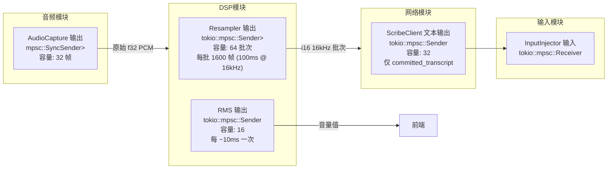
