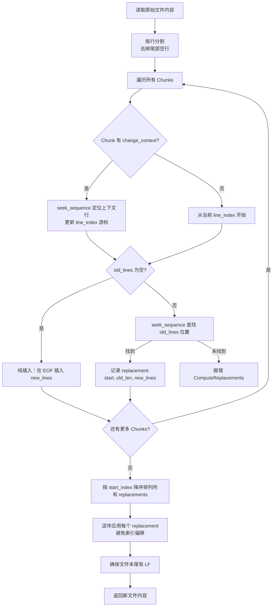
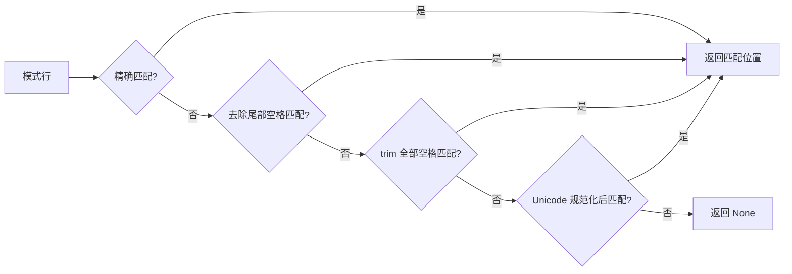
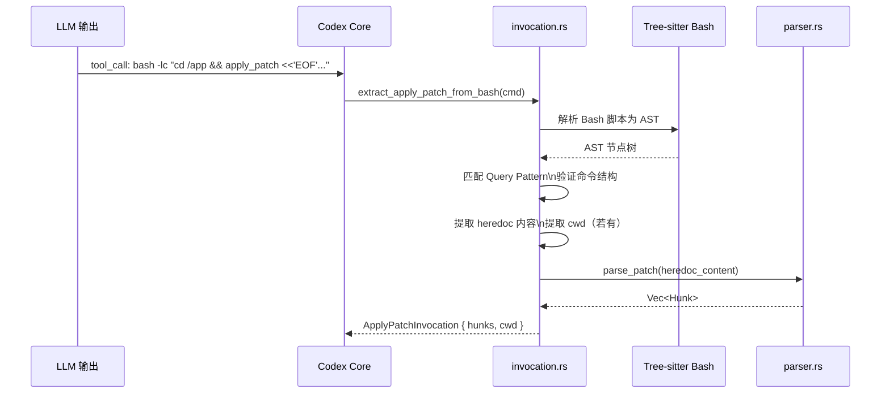
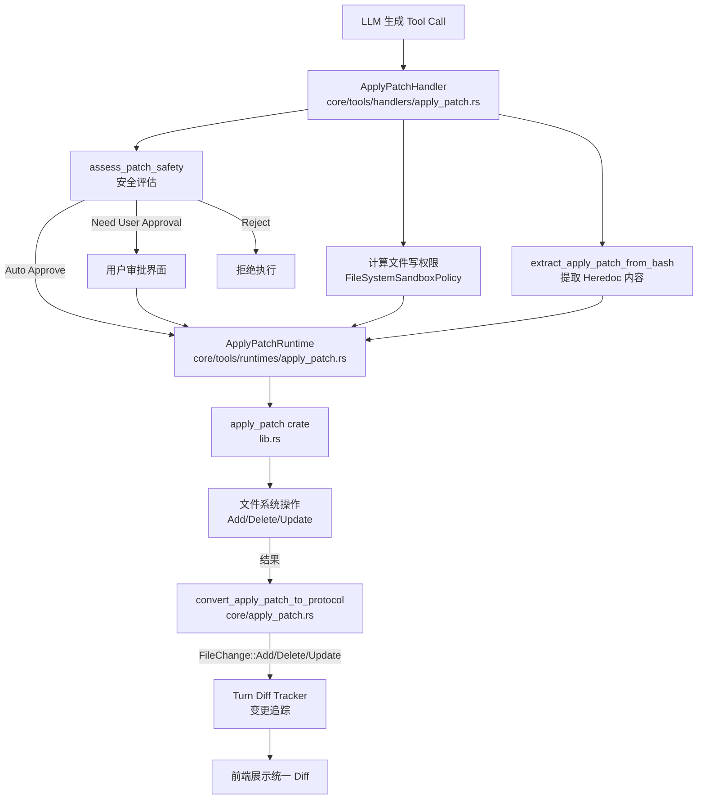
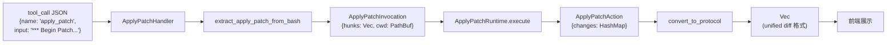
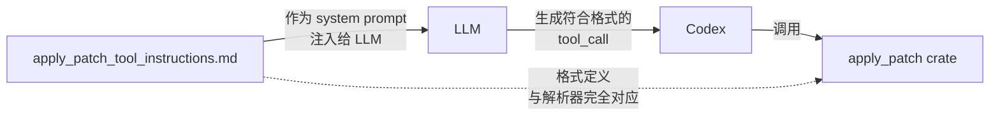
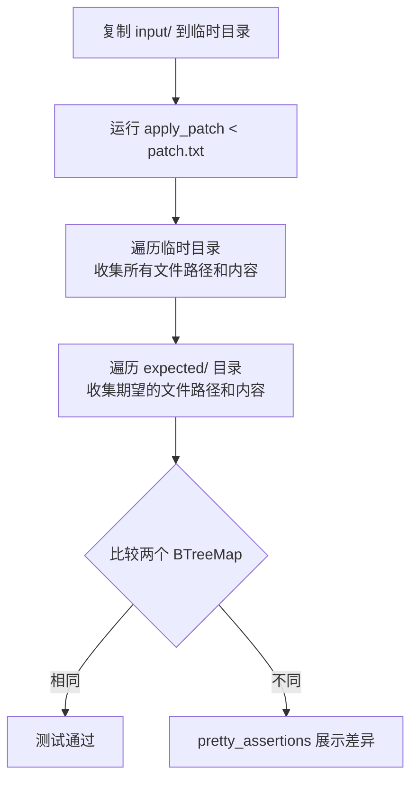
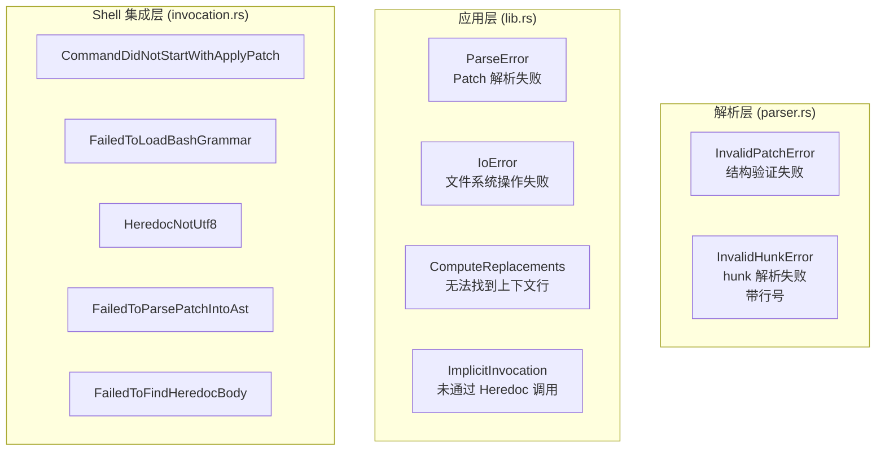

# Codex `apply_patch` 工具深度解析

> 分析基于 `venders/codex/codex-rs/apply-patch/` 及相关 core 代码

---

## 目录

1. [概述](#概述)
2. [Patch 格式与语法](#patch-格式与语法)
3. [核心解析算法](#核心解析算法)
4. [核心应用算法](#核心应用算法)
5. [Shell 集成：Heredoc 提取](#shell-集成heredoc-提取)
6. [与 Codex 系统的集成](#与-codex-系统的集成)
7. [apply_patch_tool_instructions.md 的作用](#apply_patch_tool_instructionsmd-的作用)
8. [测试策略](#测试策略)
9. [错误处理体系](#错误处理体系)
10. [关键数据结构](#关键数据结构)

---

## 概述

`apply_patch` 是专为 LLM（大语言模型）生成的代码补丁设计的工具，是 Codex 代码助手系统中 AI Agent 修改文件的核心手段。它解决了以下核心问题：

- 标准 `unified diff` 对 LLM 不够友好（行号容易出错）
- 需要一种对上下文敏感的、容错性更强的 patch 格式
- 需要深度集成 Codex 的权限、安全审批和文件系统沙盒机制

### Crate 位置

```
venders/codex/codex-rs/
├── apply-patch/
│   ├── Cargo.toml
│   ├── apply_patch_tool_instructions.md   ← LLM 使用手册
│   └── src/
│       ├── lib.rs                         ← 核心 API
│       ├── main.rs                        ← CLI 入口
│       ├── parser.rs                      ← Patch 解析
│       ├── invocation.rs                  ← Shell/Heredoc 集成
│       ├── seek_sequence.rs               ← 模糊行匹配算法
│       └── standalone_executable.rs      ← CLI 实现
│   └── tests/
│       └── fixtures/scenarios/           ← 22+ 场景化测试
└── core/
    ├── src/apply_patch.rs                 ← 协议转换层
    └── src/tools/handlers/
        ├── apply_patch.rs                 ← Tool Handler
        └── tool_apply_patch.lark          ← Lark 语法定义
```

---

## Patch 格式与语法

### 正式语法（Lark EBNF）

来自 `core/src/tools/handlers/tool_apply_patch.lark`：

```lark
start: begin_patch hunk+ end_patch
begin_patch: "*** Begin Patch" LF
end_patch:   "*** End Patch" LF?

hunk: add_hunk | delete_hunk | update_hunk

add_hunk:    "*** Add File: "    filename LF add_line+
delete_hunk: "*** Delete File: " filename LF
update_hunk: "*** Update File: " filename LF change_move? change?

filename: /(.+)/
add_line: "+" /(.*)/ LF -> line

change_move: "*** Move to: " filename LF
change: (change_context | change_line)+ eof_line?
change_context: ("@@" | "@@ " /(.+)/) LF
change_line: ("+" | "-" | " ") /(.*)/ LF
eof_line: "*** End of File" LF
```

### 三种文件操作

#### 1. Add File（新建文件）

```
*** Add File: path/to/new_file.py
+line 1 of content
+line 2 of content
```

#### 2. Delete File（删除文件）

```
*** Delete File: path/to/old_file.py
```

#### 3. Update File（修改文件）

```
*** Update File: src/app.py
[*** Move to: src/main.py]       ← 可选：同时重命名
@@ def greet():                  ← 可选：定位上下文（@@ 函数名/类名）
 context_before                  ← 空格前缀：上下文行
-old_line                        ← 减号前缀：删除行
+new_line                        ← 加号前缀：添加行
 context_after
```

### 完整示例

```
*** Begin Patch
*** Add File: hello.txt
+Hello world
*** Update File: src/app.py
*** Move to: src/main.py
@@ def greet():
-print("Hi")
+print("Hello, world!")
*** Delete File: obsolete.txt
*** End Patch
```

---

## 核心解析算法

`parser.rs` 负责将 patch 文本转换为结构化 `Vec<Hunk>`。

### 解析流程

```mermaid
flowchart TD
    A[原始 Patch 文本] --> B{边界检查}
    B -->|Strict Mode| C[检查 '*** Begin Patch' / '*** End Patch']
    B -->|Lenient Mode| D[检测并剥离 Heredoc 标记]
    D --> C
    C -->|通过| E[逐行解析 Hunks]
    C -->|失败| F[InvalidPatchError]
    E --> G{当前行类型?}
    G -->|*** Add File:| H[解析 Add Hunk\n收集所有 '+' 前缀行]
    G -->|*** Delete File:| I[解析 Delete Hunk\n仅读取路径]
    G -->|*** Update File:| J[解析 Update Hunk]
    J --> K{是否有 *** Move to:?}
    K -->|是| L[记录目标路径]
    K -->|否| M[解析 Chunks]
    L --> M
    M --> N{当前行?}
    N -->|@@ ...| O[开始新 Chunk]
    N -->|' '/'-'/'+'| P[累积行到当前 Chunk]
    N -->|*** End of File| Q[标记 EOF Chunk]
    N -->|下一个 ***| R[返回已解析 Hunks]
    H --> S[返回 Hunk::AddFile]
    I --> T[返回 Hunk::DeleteFile]
    Q --> U[返回 Hunk::UpdateFile]
    R --> U
```

### 宽松模式（Lenient Mode）

当前代码默认以宽松模式运行（`PARSE_IN_STRICT_MODE = false`），专门处理 GPT-4.1 有时错误生成 Heredoc 格式的情况：

```
<<'EOF'
*** Begin Patch
...
*** End Patch
EOF
```

解析器会检测并剥离 `<<EOF`、`<<'EOF'`、`<<"EOF"` 等 Heredoc 标记。

---

## 核心应用算法

`lib.rs` 中 `derive_new_contents_from_chunks` 是将解析后的 Hunk 真正应用到文件的核心函数。

### 应用流程



### 关键：逆序应用替换

```
原始文件行号: [0, 1, 2, 3, 4, 5, 6, 7, 8, 9]
替换计划:     替换 [2..4] 和 替换 [7..8]

正序应用（错误）:
  1. 替换 [2..4] → 行号偏移，[7..8] 实际变成了别处

逆序应用（正确）:
  1. 先替换 [7..8] → 不影响 [2..4] 的位置
  2. 再替换 [2..4] → 安全
```

---

## 模糊行匹配：`seek_sequence`

`seek_sequence.rs` 实现了渐进式宽松匹配，专门对抗 LLM 生成内容中的细微差异：



Unicode 规范化会将「花式字符」转换为 ASCII 等价物：
- 花式破折号 `\u{2010}`～`\u{2015}` → `-`
- 弯引号 `\u{2018}` `\u{2019}` → `'`
- 弯双引号 `\u{201C}` `\u{201D}` → `"`
- 不间断空格 `\u{00A0}` → ` `

---

## Shell 集成：Heredoc 提取

`invocation.rs` 使用 **Tree-sitter Bash 解析器**精确提取 apply_patch 调用。

### 三种调用形式

```bash
# 形式 1：直接字面量（罕见）
apply_patch "*** Begin Patch\n..."

# 形式 2：Heredoc（主要形式）
apply_patch <<'EOF'
*** Begin Patch
...
*** End Patch
EOF

# 形式 3：切换目录后调用
cd /some/path && apply_patch <<'EOF'
*** Begin Patch
...
*** End Patch
EOF
```

### Tree-sitter 解析流程



### 支持的 Shell 类型

| Shell | 调用形式 |
|-------|---------|
| bash / zsh / sh | `-c` 或 `-lc` 标志 |
| PowerShell / pwsh | `-Command` 标志 |
| cmd.exe | `/c` 标志 |

---

## 与 Codex 系统的集成



### 核心集成点

| 文件 | 职责 |
|------|------|
| `core/src/tools/handlers/apply_patch.rs` | 参数解析、安全评估、权限计算 |
| `core/src/tools/runtimes/apply_patch.rs` | 在 codex 执行环境中运行 patch |
| `core/src/apply_patch.rs` | 将内部结果转换为协议 `FileChange` |
| `core/src/tools/handlers/tool_apply_patch.lark` | 用于 LLM 工具调用的 Lark 语法 |

### 数据流



---

## apply_patch_tool_instructions.md 的作用

这个文件是**写给 LLM 看的使用手册**，它不是代码，而是 prompt 的一部分，指导 LLM 正确生成 apply_patch 调用。

### 它解决的问题

LLM 在生成代码补丁时常见的错误：
1. 上下文行不足，导致无法定位修改位置
2. 路径使用绝对路径而非相对路径
3. 忘记在 Add File 的行前加 `+` 前缀
4. 混淆 `@@` 的使用场景

### 文件内容结构

```
apply_patch_tool_instructions.md
├── 格式概述（Patch 信封结构）
├── 三种操作头部说明
├── 上下文提供指南
│   ├── 默认：修改前后各 3 行
│   ├── 使用 @@ 定位函数/类
│   └── 重复代码时使用多个 @@ 行
├── 正式语法（EBNF）
├── 完整示例
└── 重要约束
    ├── 必须包含 Action Header
    ├── 新行必须以 + 开头（包括 Add 操作）
    └── 路径必须是相对路径
```

### 与 apply_patch crate 的关系



**格式约束对应关系：**

| 手册中的规定 | crate 中的实现 |
|-------------|--------------|
| 以 `*** Begin Patch` 开头 | `check_patch_boundaries_*` 验证 |
| `+` 前缀代表新增行 | `parser.rs` 中 `add_line` 规则 |
| `@@` 标记代码位置 | `seek_sequence.rs` 定位上下文 |
| 路径为相对路径 | `lib.rs` 中 `cwd.join(path)` 处理 |
| 3 行上下文建议 | `seek_sequence` 需要足够的上下文匹配 |

---

## 测试策略

### 场景化测试（Fixture-Based）

```
tests/fixtures/scenarios/
├── 001_add_file/
│   ├── input/          ← 测试前文件系统状态
│   ├── patch.txt       ← 要应用的 patch
│   └── expected/       ← 期望的最终文件系统状态
├── 002_multiple_operations/
...
└── 022_update_file_end_of_file_marker/
```

**测试执行流程：**



### 22+ 测试场景覆盖范围

| 编号 | 场景 | 类型 |
|------|------|------|
| 001 | 添加单个文件 | 正常 |
| 002 | 多操作（add+delete+update） | 正常 |
| 003 | 单文件多 chunk | 正常 |
| 004 | 移动到新目录 | 正常 |
| 005 | 拒绝空 patch | 错误 |
| 006 | 拒绝缺少上下文 | 错误 |
| 007 | 拒绝缺少要删除的文件 | 错误 |
| 008 | 拒绝空 update hunk | 错误 |
| 009 | update 要求文件已存在 | 错误 |
| 010 | 移动覆盖已有文件 | 边界 |
| 011 | add 覆盖已有文件 | 边界 |
| 012 | 删除目录失败 | 错误 |
| 013 | 拒绝无效 hunk header | 错误 |
| 014 | 自动追加尾部换行 | 行为 |
| 015 | 部分成功后保留已完成变更 | 边界 |
| 016 | 纯插入 update chunk | 正常 |
| 017 | Hunk header 有空格填充 | 宽松 |
| 018 | Patch 标记有空格填充 | 宽松 |
| 019 | Unicode 字符 | 正常 |
| 020 | 删除文件成功 | 正常 |
| 021 | update 文件纯删除 | 正常 |
| 022 | End of File 标记 | 正常 |

### 单元测试覆盖

- **parser.rs**：边界检查、各类 hunk 解析、heredoc 宽松解析
- **seek_sequence.rs**：精确/宽松/Unicode 匹配，边界条件
- **invocation.rs**：各种 Shell 调用形式的提取，非法形式的拒绝
- **lib.rs**：端到端集成（创建、删除、更新、移动、多 chunk）

---

## 错误处理体系



---

## 关键数据结构

### Hunk（解析结果）

```rust
pub enum Hunk {
    AddFile {
        path: PathBuf,
        contents: String,
    },
    DeleteFile {
        path: PathBuf,
    },
    UpdateFile {
        path: PathBuf,
        move_path: Option<PathBuf>,
        chunks: Vec<UpdateFileChunk>,
    },
}
```

### UpdateFileChunk（Diff 块）

```rust
pub struct UpdateFileChunk {
    pub change_context: Option<String>,  // @@ 后的上下文文本
    pub old_lines: Vec<String>,          // 包含 context + 删除行
    pub new_lines: Vec<String>,          // 包含 context + 新增行
    pub is_end_of_file: bool,            // 是否匹配文件末尾
}
```

### ApplyPatchFileChange（应用结果）

```rust
pub enum ApplyPatchFileChange {
    Add {
        content: String,
    },
    Delete {
        content: String,              // 被删除文件的原内容（用于 diff）
    },
    Update {
        unified_diff: String,         // 用于展示的 unified diff
        move_path: Option<PathBuf>,
        new_content: String,
    },
}
```

---

## 总结

`apply_patch` 工具的设计体现了以下核心思想：

1. **LLM 友好性**：格式简洁直观，无需行号，上下文匹配容错
2. **渐进式宽松**：从精确匹配到 Unicode 规范化，最大化成功率
3. **安全第一**：与 Codex 权限/沙盒系统深度集成，敏感操作需用户审批
4. **关注点分离**：解析（parser.rs）、应用（lib.rs）、Shell 集成（invocation.rs）、系统集成（core/）各司其职
5. **面向测试**：22+ 场景测试 + 单元测试确保每个边界条件都被覆盖
